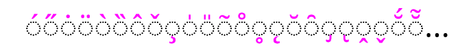
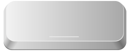
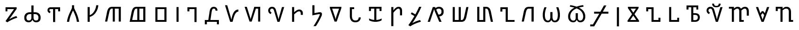
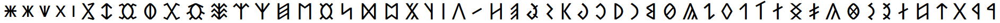
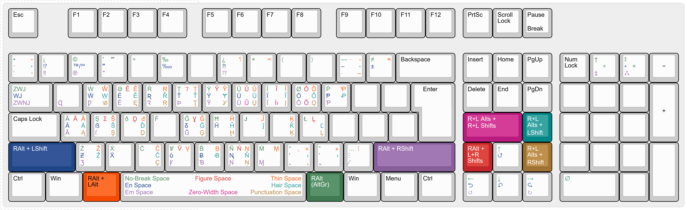
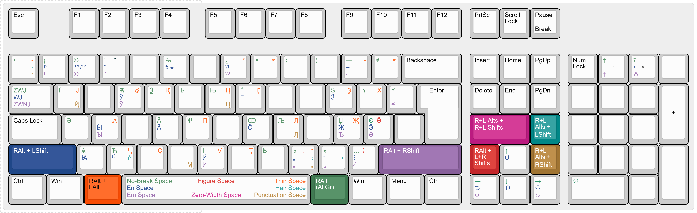
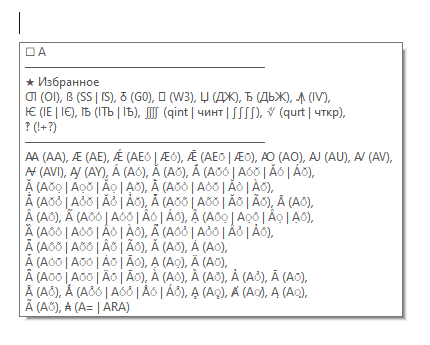
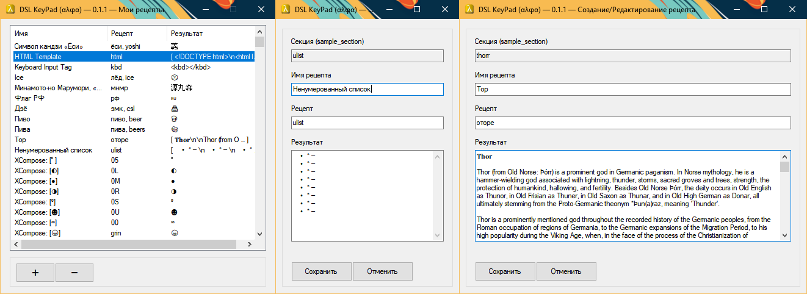
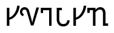

# DSL KeyPad

-yellow>)  

# Table of Contents [Содержание]

- [Overview](#overview)
  - [Latin, Cyrillic Scripts & Other Character Sets](#latin-script)
  - [Alternative Input Modes](#alternative-input-modes)
  - [Important Functions](#important-functions)
    - [Activation Groups](#activation-groups)
    - [“Fast Keys”](#fast-keys)
    - [“Forge”](#forge)
    - [Input Modifiers](#modifiers)
  - [Auxiliary Functions](#auxiliary-functions)
  - [Interface](#interface)
  - [Limitations](#limitations)
  - [Installation](#installation)
- [Обзор](#обзор)
  - [Латиница, Кириллица и прочие наборы символов](#латиница)
  - [Альтернативные режимы ввода](#альтернативные-режимы-ввода)
  - [Важные функции](#важные-функции)
    - [Группы активации](#группы-активации)
    - [«Быстрые ключи»](#быстрые-ключи)
    - [«Плавильня»](#плавильня)
    - [Модификаторы ввода](#модификаторы-ввода)
  - [Вспомогательные функции](#вспомогательные-функции)
  - [Интерфейс](#интерфейс)
  - [Ограничения](#ограничения)
  - [Установка](#установка)

# Обзор


«DSL KeyPad» — утилита на языке [AutoHotkey 2.0](https://www.autohotkey.com/) для ввода широкого спектра символов посредством горячих клавиш и вспомогательных функций. Основное направление — расширение возможностей для ввода латиницы и кириллицы, что позволяет писать на множестве языков без использования отдельных раскладок для каждого из языков.

Доступно более 2 900 символов юникода.


### Латиница

Утилита поддерживает ввод большинства символов латиницы, включая их вариации (комбинируемые, надстрочные, подстрочные, математические). Имея лишь базовую US раскладку возможно письмо на множестве языков/систем (включая исторических) на основе латиницы, например:

- [Limba Românească](https://ru.wikipedia.org/wiki/Румынский_язык): Țara, Învăța, Șase.
- [Gagauzça](https://ru.wikipedia.org/wiki/Гагаузский_язык): Sölzlük, Harţaklı, Sürçmää.
- [Ænglisċ](https://ru.wikipedia.org/wiki/Древнеанглийский_язык): Ƿeorðmyndum, Æġhƿylc, Þeod.
- [Norrœnt Mál](https://ru.wikipedia.org/wiki/Древнескандинавский_язык): Þrúðvangar, Mjǫðr, Kvæði.
- [Norsk](https://ru.wikipedia.org/wiki/Норвежский_язык): Høvåg, Ærlig, Skatteøya.
- [Deutsch](https://ru.wikipedia.org/wiki/Немецкий_язык): Straße, Österreich, Süß.
- [Français](https://ru.wikipedia.org/wiki/Французский_язык): Déjà, Sœur, Laïque.
- [Malti](https://ru.wikipedia.org/wiki/Мальтийский_язык): Għaqda, Iżda, Oċean.
- [Español](https://ru.wikipedia.org/wiki/Испанский_язык): ¿Cuántos años…, Éxito, Corazón.
- [Język polski](https://ru.wikipedia.org/wiki/Польский_язык): Wiedźmin, Żołnierz, Natknąć się.
- [Čeština](https://ru.wikipedia.org/wiki/Чешский_язык): Zřetelně, Výpůjčka, Vyvíjí.
- [Latviešu valoda](https://ru.wikipedia.org/wiki/Латышский_язык): Katoļu ticību, Luterāņu katķisma.
- [ Tiếng Việt](https://ru.wikipedia.org/wiki/Вьетнамский_язык): Thương Ưởng, Đế Chế, Rồng phương Bắc.<br>&emsp;Для облегчения письма присутствует Vietnamese TELEX/VNI‐подобный режим ввода: <kbd>RAlt F2</kbd>
- [ Hànyǔ Pīnyīn「汉语拼音」](https://ru.wikipedia.org/wiki/Пиньинь): Māo「貓」, Gǔ「谷」, Gōngtíng「宮廷」.<br>&emsp;Аналогично присутствует Vietnamese TELEX/VNI‐подобный режим ввода: <kbd>RAlt RShift F2</kbd>

[Здесь](https://github.com/DemerNkardaz/DSL-KeyPad/wiki/Languages-Input〈Fast-Keys-%25-Compose〉) представлен перечень таблиц‐подсказок для многоязычного ввода.


### Кириллица

Поддерживается и множество кириллических символов, требующих наличие обычной русскоязычной раскладки. Как и в случае с латиницей, возможно письмо на ряде языков (включая исторических) с кириллическим алфавитом, например:

- [Словѣньскъ ѩзꙑкъ](https://ru.wikipedia.org/wiki/Старославянский_язык): Благоѫханиѥ, Бєꙁѹмьникъ, Єѵрѡпа.
- [Лимба Рѹмѫнѣскъ](https://ru.wikipedia.org/wiki/Старорумынский_язык): Ꙟвъца.
- [Беларуская мова](https://ru.wikipedia.org/wiki/Белорусский_язык): Драўніна, Ўніверсітэт.
- [Українська мова](https://ru.wikipedia.org/wiki/Украинский_язык): Поїзд, Білий, Євангеліє.
- [Црногорски језик](https://ru.wikipedia.org/wiki/Черногорский_язык): Ђетић, Ђевојка, Коштањ.
- [Македонски јазик](https://ru.wikipedia.org/wiki/Македонский_язык): Џоконда, Луѓе, Одењето.
- [Қазақ тілі](https://ru.wikipedia.org/wiki/Казахский_язык): Мәліметтер, Ыңғай, Көз.
- [Забони тоҷикӣ](https://ru.wikipedia.org/wiki/Таджикский_язык): Дӯстон, Баҳри.


### Греческий

На данный момент отдельной поддержки для греческого языка и языков на основе греческого письма нет. Однако имеются мысли о её вводе в будущем.<br><br>

---


### Пунктуация

Дополнительно ко вводу букв, поддерживается и ввод множества символов для пунктуации на различных языках, например:

| Символы                | Пример                                                                                                                                                          |
| ---------------------- | --------------------------------------------------------------------------------------------------------------------------------------------------------------- |
| ! ‼ ⁉ ¡ ? ⁇ ¿ ⸮ ⁈ ‽ ⸘  | ¿En qué dirección están las montañas? <br> ¡Madre mía, esto es un descubrimiento increíble!                                                                     |
| … ⁚ ⁝ ⁞ ·              | Диапазон чисел: −15…17,3 ℃                                                                                                                                      |
| ‐ ‑ — – ⸻ ⸺ ‒ ‧        | Диапазон чисел: 15–17,3 ℃ <br> — Ёримаса, стой! — воскликнул Тадахиса. <br> “Yorimasa, stop!” — Tadahisa exclaimed.                                             |
| «» ‹› “” ‘’ „” „“ „⹂ ‚ | Организация «НВК „Рассвет“» отправила экспедицию. <br> The “SMC ‘Dawn’” organization sent an expedition. <br> Organizația „CȘM «Răsărit»” a trimis o expediție. |


### Комбинируемая диакритика

Одна из первых категорий символов, добавленных в утилиту. Включает множество «основных» диакритических знаков, комбинируемых с другими символами и используется в ряде функций утилиты для получения акцентных букв, например, в режиме «Compose»: <kbd>RAlt×2</kbd>, `A` + ◌̆ + ◌́ = `Ắ`.



<br>



### Шпации

Вторая из добавленных в утилиту категория символов. Включает почти все разновидности пробелов:

| Название                          | Ширина пробела              |
| --------------------------------- | --------------------------- |
| Неразрывный пробел                | <ins>&nbsp;</ins>           |
| Круглая шпация                    | <ins>&emsp;</ins>           |
| Полукруглая шпация                | <ins>&ensp;</ins>           |
| Цифровой пробел                   | <ins>&numsp;</ins>          |
| 1⁄3 круглой шпации                | <ins>&emsp13;</ins>         |
| 1⁄4 круглой шпации                | <ins>&emsp14;</ins>         |
| 1⁄6 круглой шпации                | <ins>&#8198;</ins>          |
| Узкий пробел                      | <ins>&thinsp;</ins>         |
| Узкий неразрывный пробел          | <ins>&#8239;</ins>          |
| Волосяная шпация                  | <ins>&hairsp;</ins>         |
| Пунктуационный пробел             | <ins>&puncsp;</ins>         |
| Пробел нулевой ширины             | <ins>&ZeroWidthSpace;</ins> |
| Неразрывный пробел нулевой ширины | <ins>&#65279;</ins>         |
| Em‑Квадрат                        | <ins>&#8193;</ins>          |
| En‑Квадрат                        | <ins>&#8192;</ins>          |
| Соединитель слов                  | <ins>&NoBreak;</ins>        |

_Соединитель слов_ не является разновидностью пробела, но был добавлен вместе со шпациями в составе «одной группы».


### …и различные прочие символы

Включён и ряд других разных символов, как знаки валют, типографские, математические знаки, стрелки и так далее, например:

| Символы                                                                                                                                                     |
| ----------------------------------------------------------------------------------------------------------------------------------------------------------- |
| ←↑↓→↖↗↙↘↔↕↺↻⮌⮍⮏⮎ <br> ※ ⁑ ⁂ ⁎ † ‡ ⹋ § © 🄯 ℗ ™ ℠ ′ ″ ‴ ⁗ ° <br> ‰ ‱ ÷ × ⋇ − ± ∓ ≈ ∽ ≋ ∑ ⨋ ∏ ∪ ∫ ∬ ∰ ∆ ∇ ≤ ≧ <br> ₽ ₹ ₱ ₴ ¢ ₣ £ ₤ ₺ € ₳ ₶ ₩ ¥ 円 元 ₫ ₮ ₸ ₪ ₿ |

---

## Альтернативные режимы ввода

Режимы, которые активируются «поверх» английской и/или русской раскладок и представляют собой, в основном, различные виды письменностей. Если у режимов одинаковая комбинация активации — они «пара», т.е. активируются одновременно и их ввод осуществляется в зависимости от текущего языка раскладки.


### [Руническое письмо](https://ru.wikipedia.org/wiki/Руны)

Активация: <kbd>RCtrl 1 (с неактивным CapsLock)</kbd><br>\[Английская раскладка\]

Включает практически все германские/англо‐саксонские рунические символы:

| Старший Футарк                                       | Футорк                                | Младший Футарк                                      | Средневековые | «Золотые числа» |
| ---------------------------------------------------- | ------------------------------------- | --------------------------------------------------- | ------------- | --------------- |
| ᚨ ᛒ ᛞ ᛖ ᚠ ᚷ ᚺ ᛁ ᛇ ᛃ ᚲ ᛚ ᛗ <br> ᚾ ᛜ ᛟ ᛈ ᚱ ᛊ ᛏ ᚦ ᚢ ᚹ ᛉ | …ᚪ ᚫ ᚳ ᛠ ᚸ ᚻ ᛄ ᛡ ᛤ ᛣ <br> ᛝ ᚩ ᛢ ᛋ ᛥ ᚣ | …ᛅ ᛆ ᛓ ᚼ ᚽ ᚴ ᛘ ᛙ ᚿ ᚬ ᚭ ᛌ <br> ᛐ ᚤ ᛦ ᛧ ᛨ ᛂ ᚧ ᛑ ᛛ ᛔ ᚡ | …ᛍ ᛀ ᚰ ᚮ ᛪ ᛎ  | …ᛮ ᛯ ᛰ          |


### [Глаголица](https://ru.wikipedia.org/wiki/Глаголица)

Активация: <kbd>RCtrl 1 (с неактивным CapsLock)</kbd><br>\[Русская раскладка\]

Старославянская письменность; Включает как обычные символы, так и комбинируемые.

| Символы (не все)                                                                               |
| ---------------------------------------------------------------------------------------------- |
| Ⰰ Ⰱ Ⰲ Ⰳ Ⰴ Ⰵ Ⰶ Ⰷ Ⰸ Ⰹ Ⰺ Ⰻ Ⰼ Ⰽ Ⰾ Ⰿ Ⱀ Ⱁ Ⱂ Ⱃ Ⱄ Ⱅ Ⱛ Ⱆ Ⱇ Ⱈ Ⱉ Ⱊ Ⱌ Ⱍ Ⱎ Ⱋ Ⱏ (ⰟⰊ) Ⱐ Ⱑ Ⱖ Ⱒ Ⱓ Ⱔ Ⱗ Ⱘ Ⱙ Ⱚ Ⱜ Ⱝ |

<details>
  <summary><strong>Перечень остальных альтернативных режимов</strong></summary>


### [Древнетюркское письмо](https://ru.wikipedia.org/wiki/Древнетюркское_письмо)

Активация: <kbd>RCtrl 1 (с активным CapsLock)</kbd><br>\[Английская раскладка\] \[Письмо справа налево\]

_Орхоно‐енисейкое письмо_

| Орхонский репертуар                                                                      | Енисейский репертуар                                            |
| ---------------------------------------------------------------------------------------- | --------------------------------------------------------------- |
| 𐰀 𐰃 𐰆 𐰇 𐰲 𐰢 𐰭 𐰯 𐱁 𐰔 𐰡 𐰨 𐰪 𐰦 𐱈 𐰉 𐰋 𐰑 𐰓 𐰞 𐰠 𐰣 𐰤 𐰺 <br> 𐰼 𐰽 𐰾 𐱃 𐱅 𐰖 𐰘 𐰍 𐰏 𐰴 𐰚 𐰸 𐰜 𐰶 𐰱 𐰿 𐰰 𐱇 | …𐰁 𐰂 𐰅 𐰄 𐰈 𐰳 𐱂 𐰕 𐰩 𐰫 𐰧 𐰊 𐰌 𐰒 𐰟 𐰥 𐰻 𐱄 𐱆 𐰗 𐰙 𐰎 <br> 𐰐 𐰵 𐰛 𐰹 𐰝 𐰷 𐱀 |


### [Древнепермское письмо](https://ru.wikipedia.org/wiki/Древнепермское_письмо)

Активация: <kbd>RCtrl 1 (с активным CapsLock)</kbd><br>\[Русская раскладка\] \[Требует шрифт [Noto Sans Old Permic](https://fonts.google.com/noto/specimen/Noto+Sans+Old+Permic)\]

Старая письменность для языков коми.

| Символы (не все)                                                         |
| ------------------------------------------------------------------------ |
|  |


### [Секейское руническое письмо](https://ru.wikipedia.org/wiki/Секельское_руническое_письмо)

Активация: <kbd>RCtrl 2 (с неактивным CapsLock)</kbd><br>\[Английская раскладка\] \[Письмо справа налево\] \[Требует шрифт [Noto Sans Old Hungarian](https://fonts.google.com/noto/specimen/Noto+Sans+Old+Hungarian)\]

Иначе — _«Венгерские руны»_

| Символы                                                                     |
| --------------------------------------------------------------------------- |
|  |


### [Готское письмо](https://ru.wikipedia.org/wiki/Готское_письмо)

Активация: <kbd>RCtrl 2 (с активным CapsLock)</kbd><br>\[Английская раскладка\]

| Символы                                                                                                                                                                                                                                            |
| -------------------------------------------------------------------------------------------------------------------------------------------------------------------------------------------------------------------------------------------------- |
| &#66352; &#66353; &#66354; &#66355; &#66356; &#66357; &#66358; &#66359; &#66360; &#66361; &#66362; &#66363; &#66364; &#66365; &#66366; &#66367; &#66368; &#66369; &#66370; &#66371; &#66372; &#66373; &#66374; &#66375; &#66376; &#66377; &#66378; |


### [Древнеиталийское письмо](https://ru.wikipedia.org/wiki/Этрусский_алфавит)

Активация: <kbd>RCtrl 3 (с неактивным CapsLock)</kbd><br>\[Английская раскладка\]

Символы древних алфавитов Апеннинского полуострова.

| Символы                                                                                                                                                                                                                                                                                                                                                        |
| -------------------------------------------------------------------------------------------------------------------------------------------------------------------------------------------------------------------------------------------------------------------------------------------------------------------------------------------------------------- |
| &#66304; &#66305; &#66306; &#66332; &#66307; &#66308; &#66349; &#66309; &#66330; &#66310; &#66311; &#66313; &#66333; &#66314; &#66329; &#66315; &#66316; &#66317; &#66319; &#66320; &#66328; &#66322; &#66323; &#66331; &#66324; &#66318; &#66321; &#66335; &#66325; &#66312; &#66326; &#66334; &#66327; &#66350; &#66351; &#66336; &#66337; &#66338; &#66339; |


### [Финикийское письмо](https://ru.wikipedia.org/wiki/Финикийское_письмо)

Активация: <kbd>RCtrl 3 (с активным CapsLock)</kbd><br>\[Английская раскладка\] \[Письмо справа налево\]

| Символы                                                                                                                                                                                                                                                              |
| -------------------------------------------------------------------------------------------------------------------------------------------------------------------------------------------------------------------------------------------------------------------- |
| &#67840; &#67855; &#67841; &#67842; &#67843; &#67844; &#67847; &#67845; &#67846; &#67849; &#67850; &#67851; &#67852; &#67853; &#67854; &#67860; &#67856; &#67857; &#67858; &#67859; &#67861; &#67848; &#67862; &#67866; &#67867; &#67863; &#67864; &#67865; &#67871; |


### Древнеаравийское письмо ([Южноаравийское](https://ru.wikipedia.org/wiki/Южноаравийское_письмо) и [Североаравийское](https://en.wikipedia.org/wiki/Ancient_North_Arabian))

Активация: <kbd>RCtrl 4 (с неактивным/активным CapsLock)</kbd><br>\[Английская раскладка\] \[Письмо справа налево / [Бустрофедон](https://ru.wikipedia.org/wiki/Бустрофедон)\]

| Символы |
| ------- |
|         |

<br>


### [МФА](https://ru.wikipedia.org/wiki/Международный_фонетический_алфавит) и Математический режим

Активация: <kbd>RCtrl 0 (с неактивным/активным CapsLock)</kbd><br>\[Английская раскладка\]

Математический режим упрощает доступ ко множеству математических символов через клавиши A–Z, в то время как второй режим упрощает ввод символов Международного фонетического алфавита.

_Оба режима не завершены_

</details>

---

<br>

## Важные функции

### Группы активации

Ограниченный базовый метод ввода символов, требующий активировать «группу», а затем ввести символ‐ключ, например, <kbd>LWin LAlt F1</kbd> активирует первую группу диакритики, после чего ввод <kbd>m</kbd> вставит ◌̄, или ввод <kbd>M</kbd> → ◌̱ . Перечень ключей для каждой группы доступен на «Панели» во вкладках «Диакритика» и «Пробелы и спец‐символы».

Всего групп восемь:

| Группа                      | Активация                   |
| --------------------------- | --------------------------- |
| Первая группа диакритики    | <kbd>LWin LAlt F1</kbd>     |
| Вторая группа диакритики    | <kbd>LWin LAlt F2</kbd>     |
| Третья группа диакритики    | <kbd>LWin LAlt F3</kbd>     |
| Четвёртая группа диакритики | <kbd>LWin LAlt F6</kbd>     |
| Группа спецсимволов         | <kbd>LWin LAlt F7</kbd>     |
| Группа шпаций               | <kbd>LWin LAlt Пробел</kbd> |
| Группа дефисов и тире       | <kbd>LWin LAlt -</kbd>      |
| Группа кавычек              | <kbd>LWin LAlt "</kbd>      |

<br>

### «Быстрые ключи»

Активация: <kbd>RAlt F1</kbd> (запоминает состояние)

Основной метод ввода для множества символов латиницы, кириллицы, пукнтуации, шпаций и прочих знаков. Утилизирует <kbd>LAlt</kbd>, <kbd>LCtrl LAlt</kbd>, <kbd>RAlt</kbd>, <kbd>RShift</kbd> как стартовые модификаторы для комбинаций, например:

- <kbd>RAlt A</kbd> — Ă
- <kbd>RAlt RShift A</kbd> — Ā
- <kbd>RAlt LShift A</kbd> — Ä
- <kbd>RAlt LShift RShift A</kbd> — Ã
- <kbd>RAlt LAlt A</kbd> — Â
- <kbd>RAlt LAlt RShift A</kbd> — Ą
- <kbd>RAlt LAlt LShift A</kbd> — Å
- <kbd>LAlt A</kbd> — Á
- <kbd>RShift A</kbd> — À
- <kbd>RShift LShift A</kbd> — Ȁ

Так как «Быстрые ключи» регистрируют внушительное количество комбинаций, по умолчанию они отключены. Группировка комбинаций происходит по следующему принципу: <kbd>LCtrl LAlt</kbd> в «Быстрых ключах» отведены в основном под комбинируемую диакритику (за исключением <kbd>LCtrl LAlt - _или_ NumPad0</kbd>, дающим _мягкий перенос_ или ◌ соответственно), например — <kbd>LCtrl LAlt M</kbd> даст ◌̄, <kbd>… LShift D</kbd> — ◌̈ ; <kbd>RAlt</kbd> — основная клавиша для ввода прочих символов; <kbd>LAlt / RShift</kbd> используются по остаточному принципу — если, например, что‐то не влезло в <kbd>RAlt</kbd> — символы латиницы с акутом располагаются именно на комбинациях с <kbd>LAlt</kbd>, а с грависом — на комбинациях с <kbd>RShift</kbd>.

#### Простые комбинации

Небольшая группа биндов для нампада, не использующая указанные выше модификаторы:

| Комбинация                        | Символ               |
| --------------------------------- | -------------------- |
| <kbd>NumPad Sub</kbd> («-»)       | − (символ минуса)    |
| <kbd>NumPad Sub Add</kbd> («-+»)  | ∓                    |
| <kbd>NumPad Add Sub</kbd> («+-»)  | ±                    |
| <kbd>NumPad Div</kbd> («/»)       | ÷ (обелюс)           |
| <kbd>NumPad Mul</kbd> («\*»)      | × (символ умножение) |
| <kbd>NumPad Div Mul</kbd> («/\*») | ⋇                    |

#### Карты символов «Быстрых ключей»

<details>
	<summary>Латиница</summary>
<br>

**RAlt Комбинации**

<details>
	<summary>Пермассылка</summary>

```
https://www.keyboard-layout-editor.com/##@_css=* {%0A%20%20%20 font-size%2F: 11px%2F%3B%0A}%0A%0A.keylabel.keylabel10 > div {%0A%20%20%20 font-size%2F: 9px%2F%3B%0A%20%20%20 line-height%2F: 1em%2F%3B%0A%20%20%20 font-weight%2F: 800%2F%3B%0A%20%20%20 color%2F: %23eee%2F%3B%0A}%3B&@=Esc&_x:1%3B&=F1&=F2&=F3&=F4&_x:0.5%3B&=F5&=F6&=F7&=F8&_x:0.5%3B&=F9&=F10&=F11&=F12&_x:0.25%3B&=PrtSc&=Scroll Lock&=Pause%0ABreak%3B&@_y:0.5&t=%23407A52%0A%23875F9A%0A%23f74b03%0A%23a07432%0A%0A%0A%231F4788%0A%23008787%3B&=•%0A’%0A⁃%0A◦%0A~%0A%0A·%0A‣&_t=%23407A52%0A%23875F9A%0A%0A%0A%0A%0A%231F4788%3B&=¡%0A‼%0A%0A%0A1%0A%0A⁉&=©%2F%2F®%0A℗%0A%0A%0A2%0A%0A™%2F%2F℠&_t=%23407A52%0A%23875F9A%0A%0A%0A%0A%0A%231F4788%0A%0AC3272B%3B&=′%0A″%0A%0A%0A3%0A%0A‴%0A%0A⁗&_t=%23407A52%3B&=÷%0A%0A%0A%0A4&_t=%23407A52%0A%0A%0A%0A%0A%0A%231F4788%3B&=‰%0A%0A%0A%0A5%0A%0A‱&_t=%23000000&a:7%3B&=%0A%0A%0A%0A6&_t=%23407A52%0A%23875F9A%0A%23f74b03%0A%0A%0A%0A%231F4788&a:4%3B&=¿%0A⁇%0A⸮%0A%0A7%0A%0A⁈&_t=%23407A52%0A%0A%23f74b03%3B&=×%0A%0A∞%0A%0A8&_t=%23407A52%3B&=⟨%0A%0A%0A%0A9&=⟩%0A%0A%0A%0A0&_t=%23407A52%0A%23875F9A%0A%23f74b03%0A%23a07432%0A%0A%0A%231F4788%0A%23008787%0A%23C3272B%3B&=—%0A‧%0A‐%0A‒%0A-%0A%0A–%0A‑%0A‧&_t=%23407A52%0A%0A%23f74b03%0A%0A%0A%0A%231F4788%3B&=≠%0A%0A≈%0A%0A%2F=%0A%0A±&_t=%23000000&w:2%3B&=Backspace&_x:0.25%3B&=Insert&=Home&=PgUp&_x:0.25%3B&=Num Lock&_t=%23407A52%0A%23875F9A%3B&=†%0A‡%0A%0A%0A%2F%2F%0A%0A%0A%0A%0A÷&_t=%23407A52%0A%23875F9A%0A%0A%0A%0A%0A%231F4788%3B&=⁑%0A⁂%0A%0A%0A*%0A%0A⁎%0A%0A%0A×&_t=%23000000&a:7%3B&=−%0A%0A%0A%0A-%3B&@_t=%23407A52%0A%23875F9A%0A%0A%0A%0A%0A%231F4788&a:4&w:1.5%3B&=ZWJ%0AZWNJ%0A%0A%0ATab%0A%0AWJ&_t=%23000000%0A%23875F9A%0A%0A%0A%23ffffff%3B&=%0AɊ%0A%0A%0AQ&_t=%23407A52%0A%23875F9A%0A%23f74b03%0A%23a07432%0A%23ffffff%0A%0A%231F4788%0A%23008787%3B&=Ẇ%0AǷ%0AŴ%0AꟂ%0AW%0A%0AẄ%0AẈ&_t=%23407A52%0A%23875F9A%0A%23f74b03%0A%23a07432%0A%23ffffff%0A%0A%231F4788%0A%23008787%0A%23C3272B%3B&=Ə%0AĒ%0AÊ%0AĘ%0AE%0A%0AË%0AĚ%0AẼ&_t=%23407A52%0A%23875F9A%0A%23f74b03%0A%23a07432%0A%23ffffff%0A%0A%231F4788%0A%23008787%3B&=Ṙ%0AꝚ%0AṚ%0AŖ%0AR%0A%0AƦ%0AŘ&_t=%23407A52%0A%23875F9A%0A%23f74b03%0A%23a07432%0A%23ffffff%0A%0A%231F4788%0A%23008787%0A%23C3272B%3B&=Ț%0AÞ%0AṬ%0AŢ%0AT%0A%0AṪ%0AŤ%0A⹒&=Ẏ%0AȲ%0AŶ%0AỾ%0AY%0A%0AŸ%0AɎ%0AỸ&_t=%23407A52%0A%23875F9A%0A%23f74b03%0A%23a07432%0A%23ffffff%0A%0A%231F4788%0A%23008787%0A%23C3272B%0A%0A%23bb1b80%3B&=Ŭ%0AŪ%0AÛ%0AŲ%0AU%0A%0AÜ%0AŮ%0AŨ%0A%0AŰ&=Ĭ%0AĪ%0AÎ%0AĮ%0AI%0A%0AÏ%0AǏ%0AĨ%0A%0Aİı&=Ø%0AŌ%0AÔ%0AǪ%0AO%0A%0AÖ%0AǑ%0AÕ%0A%0AŐ&_t=%23407A52%0A%23875F9A%0A%23f74b03%0A%0A%23ffffff%0A%0A%231F4788%0A%23008787%3B&=Ṗ%0AƤ%0AꝔ%0A%0AP%0A%0AⱣ%0AꝒ&_t=%23000000%0A%0A%0A%0A%23ffffff&a:7%3B&=%0A%0A%0A%0A[&=%0A%0A%0A%0A]&_x:0.25&t=%23000000&a:4&w:1.25&h:2&w2:1.5&h2:1&x2:-0.25%3B&=Enter&_x:0.25%3B&=Delete&=End&=PgDn&_x:0.25&a:7%3B&=&=&=&_h:2%3B&=+%3B&@_a:4&w:1.75%3B&=Caps Lock&_t=%23407A52%0A%23875F9A%0A%23f74b03%0A%23a07432%0A%23ffffff%0A%0A%231F4788%0A%23008787%0A%23C3272B&f:4%3B&=Ă%0AĀ%0AÂ%0AĄ%0AA%0A%0AÄ%0AÅ%0AÃ&_f:3%3B&=Ș%0Aſ%0AŜ%0AŞ%0AS%0A%0Aẞ%0AŠ%0AƩ&_t=%23407A52%0A%0A%23f74b03%0A%23a07432%0A%23ffffff%0A%0A%0A%23008787%0A%23C3272B%3B&=ð%0A%0Ađ%0AḐ%0AD%0A%0A%0AĎ%0AḒ&_t=%23407A52%0A%0A%0A%0A%23ffffff%3B&=Ḟ%0A%0A%0A%0AF&_t=%23407A52%0A%23875F9A%0A%23f74b03%0A%23a07432%0A%23ffffff%0A%0A%231F4788%0A%23008787%0A%23C3272B%3B&=Ğ%0AḠ%0AĜ%0AĢ%0AG%0A%0AꝽ%0AǦ%0AƔ&_t=%23407A52%0A%0A%23f74b03%0A%23a07432%0A%23ffffff%0A%0A%231F4788%0A%23008787%3B&=Ħ%0A%0AĤ%0AḨ%0AH%0A%0AḦ%0AȞ&_t=%23407A52%0A%0A%23f74b03%0A%0A%23ffffff%0A%0A%0A%23008787%3B&=Ɉ%0A%0AĴ%0A%0AJ%0A%0A%0Aǰ&_t=%23000000%0A%0A%23f74b03%0A%23a07432%0A%23ffffff%0A%0A%0A%23008787%3B&=%0A%0AḲ%0AĶ%0AK%0A%0A%0AǨ&_t=%23407A52%0A%0A%0A%23a07432%0A%23ffffff%0A%0A%0A%23008787%0A%23C3272B%3B&=Ł%0A%0A%0AĻ%0AL%0A%0A%0AĽ%0AḼ&_t=%23000000%0A%0A%0A%0A%23ffffff&a:7%3B&=%0A%0A%0A%0A%2F%3B&=%0A%0A%0A%0A'&=%0A%0A%0A%0A\&_x:4.75&t=%23000000%3B&=&=&=%3B&@_c=%231F4788&t=%23ffffff&a:4&w:1.5&h:0.5%3B&=RAlt %2F& LShift&_c=%23C3272B&a:7&w:0.75&h:0.5%3B&=&_c=%23cccccc&t=%23407A52%0A%23875F9A%0A%23f74b03%0A%0A%23ffffff%0A%0A%231F4788%0A%23008787&a:4%3B&=Ż%0AƷ%0AẐ%0A%0AZ%0A%0AƵ%0AŽ&_t=%23407A52%0A%0A%0A%0A%23ffffff%0A%0A%231F4788%3B&=Ẋ%0A%0A%0A%0AX%0A%0AẌ&_t=%23407A52%0A%0A%23f74b03%0A%23a07432%0A%23ffffff%0A%0A%0A%23008787%3B&=Ċ%0A%0AĈ%0AÇ%0AC%0A%0A%0AČ&_t=%23407A52%0A%23875F9A%0A%23f74b03%0A%0A%23ffffff%0A%0A%231F4788%0A%0A%23C3272B%3B&=Ꝟ%0AꝨ%0AṾ%0A%0AV%0A%0AỼ%0A%0AṼ&_t=%23407A52%0A%23875F9A%0A%23f74b03%0A%0A%23ffffff%0A%0A%231F4788%0A%23008787%3B&=Ḃ%0AƁ%0AḄ%0A%0AB%0A%0AɃ%0AꞖ&_t=%23407A52%0A%23875F9A%0A%23f74b03%0A%23a07432%0A%23ffffff%0A%0A%231F4788%0A%23008787%0A%23C3272B%3B&=Ñ%0AƝ%0AṆ%0AŅ%0AN%0A%0AꞐ%0AŇ%0AṄ&_t=%23407A52%0A%23875F9A%0A%23f74b03%0A%0A%23ffffff%3B&=Ṁ%0AⱮ%0AṂ%0A%0AM&_t=%23407A52%0A%23875F9A%0A%23f74b03%0A%23a07432%0A%23ffffff%0A%0A%231F4788%0A%23008787%0A%23C3272B%3B&=“%0A„%0A«%0A„%0A,%0A%0A‘%0A‹%0A‚&_t=%23407A52%0A%23875F9A%0A%23f74b03%0A%0A%23ffffff%0A%0A%231F4788%0A%23008787%3B&=”%0A⹂%0A»%0A%0A.%0A%0A’%0A›&_t=%23407A52%0A%23875F9A%0A%0A%0A%23ffffff%0A%0A%231F4788%0A%0A%23C3272B%3B&=…%0A⁄%0A%0A%0A%2F%2F%0A%0A⁝%0A%0A⁞&_c=%23875F9A&t=%23ffffff&w:1.75&h:0.5%3B&=RAlt %2F& RShift&_c=%23C3272B&a:7&h:0.5%3B&=&_x:1.25&c=%23cccccc&t=407A52%0A%0A%0A%0A%0A%0A%231F4788&a:4%3B&=↑%0A%0A%0A%0A%0A%0A⮍&_x:1.25&t=%23000000&a:7%3B&=&=&=&_h:2%3B&=%3B&@_y:-0.5&c=%23008787&t=%23ffffff&w:1.5&h:0.5%3B&=&_c=%23bb1b80&w:0.75&h:0.5%3B&=&_x:10&c=%23a07432&w:1.75&h:0.5%3B&=&_c=%23bb1b80&h:0.5%3B&=%3B&@_y:-0.5&c=%23cccccc&t=%23000000&a:4&w:1.25%3B&=Ctrl&_w:1.25%3B&=Win&_c=%23f74b03&w:1.75&h:0.5%3B&=Right%2F&Left Alts&_c=%23cccccc&t=%23407A52%0A%23875F9A%0A%23f74b03%0A%23a07432%0A%0A%0A%231F4788%0A%23008787%0A%23C3272B%0A%0A%23bb1b80&w:5.25%3B&=No-Break Space%0AEm Space%0AThin Space%0APunct. Space%0ASpace%0A%0AEn Space%0AHair Space%0AFigure Space%0A%0AZero-Width Space&_c=%23407A52&t=%23f7f7f7&w:2.25&h:0.5%3B&=Right Alt&_c=%23cccccc&t=%23000000&w:0.75%3B&=Win&_w:1.25%3B&=Menu&_w:1.25%3B&=Ctrl&_x:0.25&t=407A52%0A%23875F9A%0A%0A%0A%0A%0A%231F4788%3B&=←%0A↺%0A%0A%0A%0A%0A⮌&_t=407A52%0A%0A%0A%0A%0A%0A%231F4788%3B&=↓%0A%0A%0A%0A%0A%0A⮏&_t=407A52%0A%23875F9A%0A%0A%0A%0A%0A%231F4788%3B&=→%0A↻%0A%0A%0A%0A%0A⮎&_x:0.25&t=407A52&w:2%3B&=∅%0A%0A%0A%0A0 %2F%2F Ins&_t=%23000000&a:7%3B&=%3B&@_y:-0.5&x:2.5&c=%23008787&t=%23ffffff&w:0.5&h:0.5%3B&=&_c=%23a07432&w:0.5&h:0.5%3B&=&_c=%23bb1b80&w:0.75&h:0.5%3B&=&_x:5.25&c=%23008787&w:0.5&h:0.5%3B&=&_c=%23a07432&w:0.5&h:0.5%3B&=&_c=%23bb1b80&w:0.5&h:0.5%3B&=&_c=%23C3272B&w:0.75&h:0.5%3B&=
```

</details>



</details>

<details>
	<summary>Кириллица</summary>

**RAlt Комбинации**

<details>
	<summary>Пермассылка</summary>

```
https://www.keyboard-layout-editor.com/##@_css=* {%0A%20%20%20 font-size%2F: 11px%2F%3B%0A}%0A%0A.keylabel.keylabel10 > div {%0A%20%20%20 font-size%2F: 9px%2F%3B%0A%20%20%20 line-height%2F: 1em%2F%3B%0A%20%20%20 font-weight%2F: 800%2F%3B%0A%20%20%20 color%2F: %23eee%2F%3B%0A}%3B&@=Esc&_x:1%3B&=F1&=F2&=F3&=F4&_x:0.5%3B&=F5&=F6&=F7&=F8&_x:0.5%3B&=F9&=F10&=F11&=F12&_x:0.25%3B&=PrtSc&=Scroll Lock&=Pause%0ABreak%3B&@_y:0.5&t=%23407A52%0A%23875F9A%0A%23f74b03%0A%23a07432%0A%0A%0A%231F4788%0A%23008787%3B&=•%0A’%0A⁃%0A◦%0AЁ%0A%0A·%0A‣&_t=%23407A52%0A%23875F9A%0A%0A%0A%0A%0A%231F4788%3B&=¡%0A‼%0A%0A%0A1%0A%0A⁉&=©%2F%2F®%0A℗%0A%0A%0A2%0A%0A™%2F%2F℠&_t=%23407A52%0A%23875F9A%0A%0A%0A%0A%0A%231F4788%0A%0AC3272B%3B&=′%0A″%0A%0A%0A3%0A%0A‴%0A%0A⁗&_t=%23407A52%3B&=÷%0A%0A%0A%0A4&_t=%23407A52%0A%0A%0A%0A%0A%0A%231F4788%3B&=‰%0A%0A%0A%0A5%0A%0A‱&_t=%23000000&a:7%3B&=%0A%0A%0A%0A6&_t=%23407A52%0A%23875F9A%0A%23f74b03%0A%0A%0A%0A%231F4788&a:4%3B&=¿%0A⁇%0A⸮%0A%0A7%0A%0A⁈&_t=%23407A52%0A%0A%23f74b03%3B&=×%0A%0A∞%0A%0A8&_t=%23407A52%3B&=⟨%0A%0A%0A%0A9&=⟩%0A%0A%0A%0A0&_t=%23407A52%0A%23875F9A%0A%23f74b03%0A%23a07432%0A%0A%0A%231F4788%0A%23008787%0A%23C3272B%3B&=—%0A‧%0A‐%0A‒%0A-%0A%0A–%0A‑%0A‧&_t=%23407A52%0A%0A%23f74b03%0A%0A%0A%0A%231F4788%3B&=≠%0A%0A≈%0A%0A%2F=%0A%0A±&_t=%23000000&w:2%3B&=Backspace&_x:0.25%3B&=Insert&=Home&=PgUp&_x:0.25%3B&=Num Lock&_t=%23407A52%0A%23875F9A%3B&=†%0A‡%0A%0A%0A%2F%2F%0A%0A%0A%0A%0A÷&_t=%23407A52%0A%23875F9A%0A%0A%0A%0A%0A%231F4788%3B&=⁑%0A⁂%0A%0A%0A*%0A%0A⁎%0A%0A%0A×&_t=%23000000&a:7%3B&=−%0A%0A%0A%0A-%3B&@_t=%23407A52%0A%23875F9A%0A%0A%0A%0A%0A%231F4788&a:4&w:1.5%3B&=ZWJ%0AZWNJ%0A%0A%0ATab%0A%0AWJ&_t=%23407A52%0A%0A%23f74b03%0A%23a07432%3B&=Ї%0A%0AЈ%0AҊ%0AЙ&_t=%23000000&a:7%3B&=%0A%0A%0A%0AЦ&_t=%23407A52%0A%23875F9A%0A%23f74b03%0A%0A%0A%0A%231F4788&a:4%3B&=Ѫ%0AӮ%0AꙊ%0A%0AУ%0A%0AӰ&_t=%23407A52%0A%0A%23f74b03%3B&=Ѯ%0A%0AҚ%0A%0AК&_t=%23407A52%3B&=Ѣ%0A%0A%0A%0AЕ&_t=%23407A52%0A%0A%23f74b03%0A%23a07432%3B&=Њ%0A%0AҢ%0AӉ%0AН&_t=%23407A52%0A%0A%23f74b03%0A%0A%0A%0A%231F4788%3B&=Ґ%0A%0AӶ%0A%0AГ%0A%0AҒ&_t=%23000000&a:7%3B&=%0A%0A%0A%0AШ&=%0A%0A%0A%0AЩ&_t=%23407A52%0A%0A%23f74b03%0A%0A%0A%0A%231F4788&a:4%3B&=Ѕ%0A%0AҘ%0A%0AЗ%0A%0AӞ&_t=%23407A52%0A%0A%23f74b03%3B&=Һ%0A%0AҲ%0A%0AХ&_t=%23407A52%0A%23875F9A%3B&=Ү%0AҰ%0A%0A%0AЪ&_x:0.25&t=%23000000&w:1.25&h:2&w2:1.5&h2:1&x2:-0.25%3B&=Enter&_x:0.25%3B&=Delete&=End&=PgDn&_x:0.25&a:7%3B&=&=&=&_h:2%3B&=+%3B&@_a:4&w:1.75%3B&=Caps Lock&_t=%23407A52%3B&=Ѳ%0A%0A%0A%0AФ&_t=%23407A52%0A%23875F9A%0A%23f74b03%0A%0A%0A%0A%231F4788%3B&=%0AꙐ%0AꙞ%0A%0AЫ%0A%0AӸ&_t=%23000000&a:7%3B&=%0A%0A%0A%0AВ&_t=%23407A52%0A%0A%0A%0A%0A%0A%231F4788&a:4%3B&=Ӑ%0A%0A%0A%0AА%0A%0AӒ&_t=%23407A52%0A%0A%23f74b03%3B&=Ѱ%0A%0AԤ%0A%0AП&_t=%23000000&a:7%3B&=%0A%0A%0A%0AР&_t=%23407A52%0A%0A%0A%0A%0A%0A%231F4788&a:4%3B&=Ѡ%0A%0A%0A%0AО%0A%0AӦ&_t=%23407A52%0A%0A%23f74b03%0A%23a07432%3B&=Љ%0A%0AԮ%0AӅ%0AЛ&_t=%23000000&a:7%3B&=%0A%0A%0A%0AД&_t=%23407A52%0A%23875F9A%0A%23f74b03%0A%0A%0A%0A%231F4788&a:4%3B&=Џ%0AЂ%0AҖ%0A%0AЖ%0A%0AӜ&_t=407A52%0A%23875F9A%0A%0A%0A%0A%0A%231F4788%0A%0A%23C3272B%3B&=Є%0AӘ%0A%0A%0AЭ%0A%0AӬ%0A%0AӚ&_t=%23000000&a:7%3B&=%0A%0A%0A%0A\&_x:4.75%3B&=&=&=%3B&@_c=%231F4788&t=%23ffffff&a:4&w:1.5&h:0.5%3B&=RAlt %2F& LShift&_c=%23C3272B&t=%23000000&a:7&w:0.75&h:0.5%3B&=&_c=%23cccccc&t=%23407A52%0A%0A%0A%0A%0A%0A%231F4788&a:4%3B&=Ѧ%0A%0A%0A%0AЯ%0A%0AꙖ&_t=%23407A52%0A%0A%23f74b03%0A%0A%0A%0A%231F4788%0A%23008787%3B&=Ћ%0A%0AҶ%0A%0AЧ%0A%0AӴ%0AꙈ&_t=%23407A52%0A%0A%23f74b03%3B&=%0A%0AҪ%0A%0AС&_t=%23407A52%0A%0A%0A%23a07432%3B&=%0A%0A%0AӍ%0AМ&_t=%23407A52%0A%23875F9A%0A%23f74b03%0A%0A%0A%0A%231F4788%3B&=І%0AӢ%0AѴ%0A%0AИ%0A%0AӤ&_t=%23407A52%0A%0A%23f74b03%3B&=%0A%0AҬ%0A%0AТ&_t=%23407A52%3B&=Ҍ%0A%0A%0A%0AЬ&_t=%23407A52%0A%23875F9A%0A%23f74b03%0A%23a07432%0A%0A%0A%231F4788%0A%23008787%0A%23C3272B%3B&=«%0A„%0A“%0A„%0AБ%0A%0A„%0A‹%0A‚&_t=%23407A52%0A%23875F9A%0A%23f74b03%0A%0A%0A%0A%231F4788%0A%23008787%3B&=»%0A⹂%0A”%0A%0AЮ%0A%0A“%0A›&_t=%23407A52%0A%23875F9A%0A%0A%0A%0A%0A%231F4788%0A%0A%23C3272B%3B&=…%0A⁄%0A%0A%0A.%0A%0A⁝%0A%0A⁞&_c=%23875F9A&t=%23ffffff&w:1.75&h:0.5%3B&=RAlt %2F& RShift&_c=%23C3272B&a:7&h:0.5%3B&=&_x:1.25&c=%23cccccc&t=407A52%0A%0A%0A%0A%0A%0A%231F4788&a:4%3B&=↑%0A%0A%0A%0A%0A%0A⮍&_x:1.25&t=%23000000&a:7%3B&=&=&=&_h:2%3B&=%3B&@_y:-0.5&c=%23008787&t=%23ffffff&w:1.5&h:0.5%3B&=&_c=%23bb1b80&t=%23000000&w:0.75&h:0.5%3B&=&_x:10&c=%23a07432&t=%23ffffff&w:1.75&h:0.5%3B&=&_c=%23bb1b80&h:0.5%3B&=%3B&@_y:-0.5&c=%23cccccc&t=%23000000&a:4&w:1.25%3B&=Ctrl&_w:1.25%3B&=Win&_c=%23f74b03&w:1.75&h:0.5%3B&=Right%2F&Left Alts&_c=%23cccccc&t=%23407A52%0A%23875F9A%0A%23f74b03%0A%23a07432%0A%0A%0A%231F4788%0A%23008787%0A%23C3272B%0A%0A%23bb1b80&w:5.25%3B&=No-Break Space%0AEm Space%0AThin Space%0APunct. Space%0ASpace%0A%0AEn Space%0AHair Space%0AFigure Space%0A%0AZero-Width Space&_c=%23407A52&t=%23f7f7f7&w:2.25&h:0.5%3B&=Right Alt&_c=%23cccccc&t=%23000000&w:0.75%3B&=Win&_w:1.25%3B&=Menu&_w:1.25%3B&=Ctrl&_x:0.25&t=407A52%0A%23875F9A%0A%0A%0A%0A%0A%231F4788%3B&=←%0A↺%0A%0A%0A%0A%0A⮌&_t=407A52%0A%0A%0A%0A%0A%0A%231F4788%3B&=↓%0A%0A%0A%0A%0A%0A⮏&_t=407A52%0A%23875F9A%0A%0A%0A%0A%0A%231F4788%3B&=→%0A↻%0A%0A%0A%0A%0A⮎&_x:0.25&t=407A52&w:2%3B&=∅%0A%0A%0A%0A0 %2F%2F Ins&_t=%23000000&a:7%3B&=%3B&@_y:-0.5&x:2.5&c=%23008787&w:0.5&h:0.5%3B&=&_c=%23a07432&w:0.5&h:0.5%3B&=&_c=%23bb1b80&w:0.75&h:0.5%3B&=&_x:5.25&c=%23008787&w:0.5&h:0.5%3B&=&_c=%23a07432&w:0.5&h:0.5%3B&=&_c=%23bb1b80&w:0.5&h:0.5%3B&=&_c=%23C3272B&w:0.75&h:0.5%3B&=
```

</details>



</details>

<br>

### «Плавильня»

Набор методов‐обработчиков, позволяющих конвертировать последовательность одних символов в другие. Через «плавильню» реализуется вариативность методов ввода. Ряд символов, например, как «Æ», «Œ», «Ꜹ», «Ѭ», «Ѩ» и т.д. возможно напечатать только через функции «плавильни». Базово доступен в виде диалогового окна через <kbd>LWin LAlt L</kbd>.

Список доступных последовательностей можно посмотреть на «Панели» во вкладке «Плавильня».

#### «Compose»

Активация: <kbd>RAlt×2</kbd>

Дополнительный способ использования плавильни, позволяющий вводить последовательность символов не отвлекаясь от текстового поля. По мере ввода у курсора каретки или курсора мыши будет отображён список возможных комбинаций и их результата; рецепты символов из _списка избранного_ всегда будут отображены в подсказке.

Вставка символа сработает сразу как произойдёт точное совпадение ввода и любого из рецептов. Попытка ввести «sumint» для получения «⨋» закончится получением символа «∑» сразу после ввода «sum», однако активный режим можно поставить на паузу клавишей <kbd>PauseBreak</kbd> и тогда для срабатывания он будет ожидать снятия с паузы или нажатия клавиши <kbd>Enter</kbd>. Отменить режим можно с помощью клавиши <kbd>Esc</kbd> или вводом несуществующей последовательности.

С активной паузой в начало запроса можно добавить «(\~) », и тогда «Compose» сможет обрабатывать последовательность внутри слов. Например, попытка ввести «Ōthalą» (O◌̄thala◌̨) приведёт к ошибке поиска рецепта, но в случае «(\~) Ōthalą» найденные в слове последовательности будут обработаны: «Ōþalą».



#### «Мои Рецепты»

Плавильня поддерживает возможность создания собственных последовательностей через соответствующее окно интерфейса. Возможно создание рецептов с многострочным и/или объёмным результатом, но использовать через чур много текста не рекомендуется. В результатах можно использовать табуляцию. «Мои рецепты» так же будут отображаться в предложениях режима «Compose».

Для одной записи можно назначить сразу несколько последовательностей, разделяя их «|». Так, например, если установить последовательности как «змк|csl» и результат «🏯», то и «змк» и «csl» приведут к вставке эмодзи замка.

**Дополнительно:** при запуске утилита автоматически читает любые [«\*.XCompose»](https://wiki.debian.org/XCompose) файлы в поддиректории «\User\» и создает рецепты из них. Однако это работает только в отношении простых символьных последовательностей. «Мёртвые клавиши» и подобное не поддерживается.

В качестве демонстрации утилита при первом запуске создаёт файл «\User\demo.XCompose» с одним рецептом:

```lua
<Multi_key> <0> <0> : "∞"
```

И несколько «Моих рецептов» стандартного вида: Иероглиф кандзи 義, «ёси|yoshi»; шаблон базовой HTML‐разметки, «html»; тег `<kbd></kbd>`, «kbd»; и эмодзи льда 🧊, «лёд|ice».



<br>

### Модификаторы ввода

Активируемые режимы, подменяющие разновидность вводимого символа, например: вместо «Æ» можно получить капитель «ᴁ», активировав соответствующий режим. Если у символа есть те или иные разновидности, они будут помечены на «Панели» над предпросмотром выбранного знака. Есть следующие модификаторы:

<details>
<summary><strong>Список модификаторов</strong></summary>

⚠️ Для активации модификаторов, требующих нажатие <kbd>Shift</kbd>, <kbd>NumLock</kbd> должен быть выключен.

- [ ◌ͪ ] Комбинируемые символы<br>
  Активация: <kbd>LCtrl LAlt NumPad1</kbd><br>
  Примеры: ◌ͣ ◌ᷤ ◌ͩ ◌ᷫ ◌ᷚ ◌ͪ ◌ͥ ◌ᷱ ◌ͤ ◌ͬ ◌ᷢ ◌ͫ ◌ᷟ
- [ ◌ʰ ] Надстрочные/Символы‐модификаторы [(МФА)](https://ru.wikipedia.org/wiki/Международный_фонетический_алфавит)<br>
  Активация: <kbd>LCtrl LAlt LShift NumPad1</kbd><br>
  Примеры: ᵃ ᵇ ᶜ ᵈ ᵉ ᶠ ᵍ ʰ ʲ ᵏ ˡ ᵐ ᵒ ᵖ ʳ ˢ ᵗ ᵘ ᵛ ʷ ˣ ʸ ᶻ
- [ ◌ₕ ] Подстрочные символы<br>
  Активация: <kbd>LCtrl LAlt RShift NumPad1</kbd><br>
  Примеры: ₐ ₑ ₕ ᵢ ⱼ ₖ ₗ ₘ ₙ ₒ ₚ ᵣ ₛ ₜ ᵤ ᵥ ₓ

<br>

- [ 𝐻 ] Курсивные символы<br>
  Активация: <kbd>LCtrl LAlt NumPad2</kbd><br>
  Примеры: 𝑎𝑏𝑐𝑑𝑒𝑓𝑔ℎ𝑖𝑗𝑘𝑙𝑚𝑛𝑜𝑝𝑞𝑟𝑠𝑡𝑢𝑣𝑤𝑥𝑦𝑧
- [ 𝐇 ] Полужирные символы<br>
  Активация: <kbd>LCtrl LAlt LShift NumPad2</kbd><br>
  Примеры: 𝐚𝐛𝐜𝐞𝐟𝐠𝐡𝐢𝐣𝐤𝐥𝐦𝐧𝐨𝐩𝐪𝐫𝐬𝐭𝐮𝐯𝐰𝐱𝐲𝐳
- [ 𝑯 ] Полужирные курсивные символы<br>
  Активация: <kbd>LCtrl LAlt RShift NumPad2</kbd><br>
  Примеры: 𝒂𝒃𝒄𝒅𝒆𝒇𝒈𝒉𝒊𝒋𝒌𝒍𝒎𝒏𝒐𝒑𝒒𝒓𝒔𝒕𝒖𝒗𝒘𝒙𝒚𝒛

<br>

- [ ℌ ] Символы «Фрактура»<br>
  Активация: <kbd>LCtrl LAlt NumPad3</kbd><br>
  Примеры: 𝔞𝔟𝔠𝔡𝔢𝔣𝔤𝔥𝔦𝔧𝔨𝔩𝔪𝔫𝔬𝔭𝔮𝔯𝔰𝔱𝔳𝔲𝔴𝔵𝔶𝔷
- [ 𝕳 ] Полужирные символы «Фрактура»<br>
  Активация: <kbd>LCtrl LAlt LShift NumPad3</kbd><br>
  Примеры: 𝖆𝖇𝖈𝖉𝖊𝖋𝖌𝖍𝖎𝖏𝖐𝖑𝖒𝖓𝖔𝖕𝖖𝖗𝖘𝖙𝖚𝖛𝖜𝖝𝖞𝖟

<br>

- [ ℋ ] Символы «Рукописные»<br>
  Активация: <kbd>LCtrl LAlt NumPad4</kbd><br>
  Примеры: 𝒶𝒷𝒸𝒹ℯ𝒻ℊ𝒽𝒾𝒿𝓀𝓁𝓂𝓃ℴ𝓅𝓆𝓇𝓈𝓉𝓊𝓋𝓌𝓍𝓎𝓏
- [ 𝓗 ] Полужирные символы «Рукописные»<br>
  Активация: <kbd>LCtrl LAlt LShift NumPad4</kbd><br>
  Примеры: 𝓪𝓫𝓬𝓭𝓮𝓯𝓰𝓱𝓲𝓳𝓵𝓶𝓷𝓸𝓹𝓺𝓻𝓼𝓽𝓾𝓿𝔀𝔁𝔂𝔃

<br>

- [ ℍ ] Символы «Double‐Struck»<br>
  Активация: <kbd>LCtrl LAlt NumPad5</kbd><br>
  Примеры: 𝕒𝕓𝕔𝕕𝕖𝕗𝕘𝕙𝕚𝕛𝕝𝕜𝕞𝕟𝕠𝕡𝕢𝕣𝕤𝕥𝕦𝕧𝕨𝕩𝕪𝕫
- [ ⅅ ] Курсивные символы «Double‐Struck»<br>
  Активация: <kbd>LCtrl LAlt LShift NumPad5</kbd><br>
  Примеры: ⅅⅆⅇⅈⅉ

<br>

- [ 𝘏 ] Курсивные символы без засечек<br>
  Активация: <kbd>LCtrl LAlt NumPad6</kbd><br>
  Примеры: 𝘢𝘣𝘤𝘥𝘦𝘧𝘨𝘩𝘪𝘫𝘬𝘭𝘮𝘯𝘰𝘱𝘲𝘳𝘴𝘵𝘶𝘷𝘸𝘹𝘺𝘻
- [ 𝗛 ] Полужирные символы без засечек<br>
  Активация: <kbd>LCtrl LAlt LShift NumPad6</kbd><br>
  Примеры: 𝗮𝗯𝗰𝗱𝗲𝗳𝗴𝗵𝗶𝗷𝗸𝗹𝗺𝗻𝗼𝗽𝗾𝗿𝘀𝘁𝘂𝘃𝘄𝘅𝘆𝘇
- [ 𝙃 ] Полужирные курсивные символы без засечек<br>
  Активация: <kbd>LCtrl LAlt RShift NumPad6</kbd><br>
  Примеры: 𝙖𝙗𝙘𝙙𝙚𝙛𝙜𝙝𝙞𝙟𝙠𝙡𝙢𝙣𝙤𝙥𝙦𝙧𝙨𝙩𝙫𝙪𝙬𝙭𝙮𝙯

<br>

- [ 𝙷 ] Моноширинные символы<br>
  Активация: <kbd>LCtrl LAlt NumPad7</kbd><br>
  Примеры: 𝚊𝚋𝚌𝚍𝚎𝚏𝚐𝚑𝚒𝚓𝚔𝚕𝚖𝚗𝚘𝚙𝚚𝚛𝚜𝚝𝚞𝚟𝚠𝚡𝚢𝚣𝟷𝟸𝟹𝟺𝟻𝟼𝟽𝟾𝟿𝟶

<br>

- [ ʜ ] Капитель<br>
  Активация: <kbd>LCtrl LAlt NumPad8</kbd><br>
  Примеры: ᴀʙᴄᴅᴇꜰɢʜɪᴊᴋʟᴍɴᴏᴘꞯʀꜱᴛᴜᴠᴡxʏᴢ

</details>

---

<br>

## Вспомогательные функции

---

<br>

## Интерфейс

---

Старое:

Эта утилита позволяет вводить широкий спектр различных символов без надобности использования «карт символов» или других источников для копирования. Она включает в себя диакритические знаки (◌́◌̋◌̆◌̑◌̀◌̏◌̄◌̱), разновидности пробелов/шпаций (&#8198;<ins>&emsp;</ins> <ins>&ensp;</ins>&emsp13;<ins> </ins>&emsp14;<ins> </ins>&thinsp;<ins>&#8198;</ins>&#8198;) и тире/дефисов (⸻, ⸺, —, –, ‐), кавычки («Русские „Кавычки“», “English ‘Quotation Marks’”, „«Ghilimele» Românești”,「東アジアの『引用符』」), пунктуацию (…, ¡, ¿, ⁉, ⁈, ‼, ⁇, ‽, ⸘), лигатуры (ꜲÆꜶꜸꜴꜼƢꝠꙖꙒ), буквы (ĂÂǍɃḈðɆǶÞǷꝹѪѦЄҴ), валюты (₽¥₩€£₸₪) и специальные символы (§′″°∞≠≈×−±⁑⁂†‡‰‱←↓↑→↺↻⮌⮏⮍⮎250⁄250), обычно недоступные на клавиатуре. С полным перечнем символов можно ознакомиться в *Панели*, открывающуюся комбинацией <kbd>Win Alt Home</kbd> или в пунктах меню в трее.

Примечание: используйте только в паре QWERTY‐ЙЦУКЕН английской и русской раскладок, совместимость с другим не предусмотрена.

## Методы ввода

- **Группы** — базовый метод, включающий диакритические знаки, пробелы, тире/дефисы, кавычки и специальные символы. Необходимо активировать группу символов, а затем нажать на кнопку нужного знака, например: <kbd>Win Alt F1</kbd> активирует «Основную группу диакритики», после чего можно нажать на «ф(a)» для ввода акута [á] или «ь(m)» для ввода макрона [m̄]. Всего групп восемь: Диакритика (F1, F2, F3, F6), Специальные символы (F7), Шпации (Пробел), Тире (-) и Кавычки (").
- **Быстрые ключи** — использует <kbd>LCtrl LAlt</kbd>, <kbd>LAlt</kbd> или <kbd>RAlt</kbd> в качестве «начальных» клавиш комбинаций для ускоренного ввода избранных символов. Включает в себя больше символов, чем «группы».

  Диакритические знаки в основном располагаются в комбинациях с <kbd>LCtrl LAlt</kbd> Ввод, например, тех же акута и макрона, осуществляется комбинациями<kbd>LCtrl LAlt a</kbd> и <kbd>LCtrl LAlt m</kbd>

  Комбинации с <kbd>RAlt</kbd> в основном служат для ввода букв и специальных символов: <kbd>RAlt E</kbd> на английском раскладке введёт «Ĕ», а на русской «Ѫ». Комбинация <kbd>RAlt A</kbd> «Ă» или «Ѳ» соответственно. Имеется и небольшое количество «простых комбинаций» — <kbd>NumpadSub</kbd> вместо дефисо‐минуса (-) будет вводить знак минуса (−), а комбинация <kbd>NumpadAdd NumpadSub</kbd> введёт плюс-минус (±).

  **Примечание:** по умолчанию функция отключена, и её можно активировать комбинацией <kbd>RAlt Home</kbd>.

- **«Плавильня»** — конвертирует последовательность знаков («рецепт») в другой знак, что позволяет получать лигатуры («AE» → «Æ», «ІѪ» → «Ѭ»), акцентные буквы («Ă» *два символа* → «Ă» _единый символ_) или просто буквы («ПС» → «Ѱ», «КС» → «Ѯ», «ДЖ» → «Џ») и прочие символы («+−» → «±», «\*\*\*» → «⁂», «YEN» → «¥», «°C» *два символа* → «℃» _единый символ_).

  Плавильня включает в себя четыре способа её использовать:

  - Через всплывающее окно, <kbd>Win Alt L</kbd>.
  - В тексте через выделение рецепта, <kbd>RShift L</kbd>.
  - В тексте, установив курсор каретки после рецепта, <kbd>RShift Backspace</kbd>.
  - Режиме «Compose» — даёт возможность использовать «сплавку» знаков прямо при вводе, <kbd>RAlt×2</kbd>. Сразу вставляет в поле ввода первое точное совпадение с вводимой последовательностью. Есть возможность включить/отключить ожидание через <kbd>PauseBreak</kbd> (так как ряд рецептов начинаются одинакого), и «Compose» не будет сразу вставлять первое совпадение.

## Альтернативные раскладки

<kbd>RCtrl 1</kbd> активирует переключение ввода с Русского/Английского на ввод Глаголицы/Германо‐скандинавских, Англосаксонских Рун. Нажатие <kbd>А</kbd><kbd>Б</kbd> или <kbd>RAlt Ф</kbd>, например, введёт Ⰰ, Ⰱ или Ⱚ, а нажатие <kbd>A</kbd>,<kbd>W</kbd>,<kbd>F</kbd> введёт ᚨ, ᚹ, ᚠ.

<kbd>RCtrl 2</kbd> аналогично активирует ввод Древнетюркского и Древнепермского письма, «𐱃𐰞𐰤𐰪𐰅𐰺» «». Древнепермский требует шрифт [Noto Sans Old Permic](https://fonts.google.com/noto/specimen/Noto+Sans+Old+Permic).

<kbd>RCtrl 4</kbd> активирует ввод Готского письма, «𐌱𐌴𐍂𐌺𐌰𐌹𐌽𐌰 𐍉𐌸𐌰𐌻𐌰 𐍅𐌿𐌽𐌾𐌰 𐍄𐍅𐌶».

## Вспомогательные функции

- Вставка символа по ID Юникода или по Alt‐коду, <kbd>Win Alt <kbd>U</kbd>/<kbd>A</kbd></kbd>.
- Вставка символа по внутреннему тегу в утилите, <kbd>Win Alt F</kbd>.
- Конвертация числа в Римские Цифры («17489» → «ↂↁⅯⅯⅭⅭⅭⅭⅬⅩⅩⅩⅨ») или в надстрочные/подстрочные цифры, <kbd>Win RAlt <kbd>3</kbd>/<kbd>1</kbd>/<kbd>2</kbd></kbd>.
- Изменение ввода «Символ → HTML‐код/Мнемоника → LaTeX → Символ», <kbd>RAlt RShift Home</kbd>. Если переключить ввод с «Символ» на «HTML», тогда будет вводиться соответствующий код, например: вместо кавычек «» будет введено _\&laquo;\&raquo;_, или вместо Ѫ → *\&#1130;*.

  **Примечание:** LaTeX коды доступны не для всех символов, а некоторые коды указаны из подключаемых пакетов (которые указываются над кодом LaTeX в Панели).

- Обработчики текста:

  - «Кавычкизация» — обрамляет выделенный текст кавычками (в зависимости от активной раскладки): Гай Тиберий, Палач Галлов → «Гай Тиберий, Палач Галлов», или Гай Тиберий, «Палач Галлов» → «Гай Тиберий, „Палач Галлов“».
  - «GREP»‐Замены — заменяет обычные пробелы в выделенном тексте его разновидностями, например неразрывным пробелом после одно‐/двубуквенных слов (а, в, не) и некоторых трёхбуквенных (для), в цифрах (1 000, 10 000, 100 000…); узким пробелом в инициалах (И. О. Фамилия); и т.д.

    **Примечание:** основано на типографике для русского языка.

  - Отбивка отступа абзаца — добавляет в начало абзацев выделенного текста Круглую шпацию для «симуляции красной строки». Больше необходимо для тех мест, где технически нельзя создать абзацный отступ иным «цивилизованным» образом. Так же в абзацах, начинающихся с длинного тире (диалоговые абзацы) заменяет пробел после данного тире на полукруглую шпацию.

## Ограничения

Утилита может быть использована _(стабильно)_ только на Английской или Русскоязычной раскладках (включая и [«Типографскую раскладку»](https://ilyabirman.ru/typography-layout/)), так как основывается именно на их клавишах для комбинаций. Использование комбинаций «Быстрых ключей» за пределами этих раскладок игнорируется, однако «Группы» остаются доступными.

## Установка

Для использования «DSL KeyPad» требуется просто [скачать .ahk файл](https://github.com/DemerNkardaz/DSL-KeyPad/blob/main/Install.KeyPad.ahk), запустить и выбрать директорию, где будет расположена папка утилиты.

---


# License

All own code source (i.e. exclude third-party code parts) is licensed under the [MIT License](https://github.com/DemerNkardaz/DSL-KeyPad/blob/main/LICENSE)
