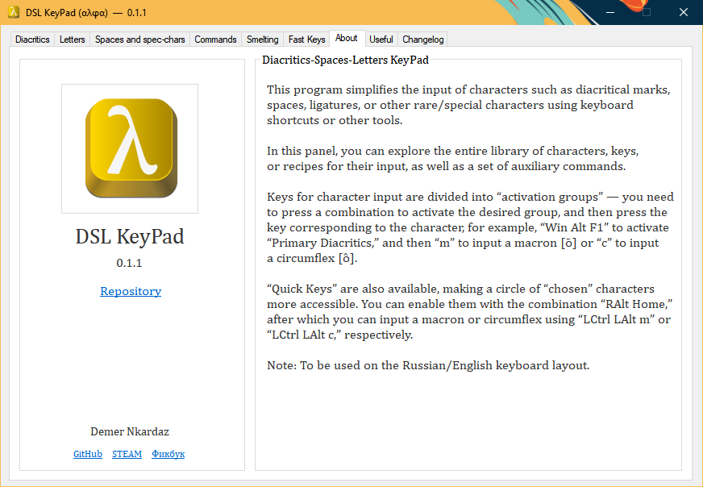
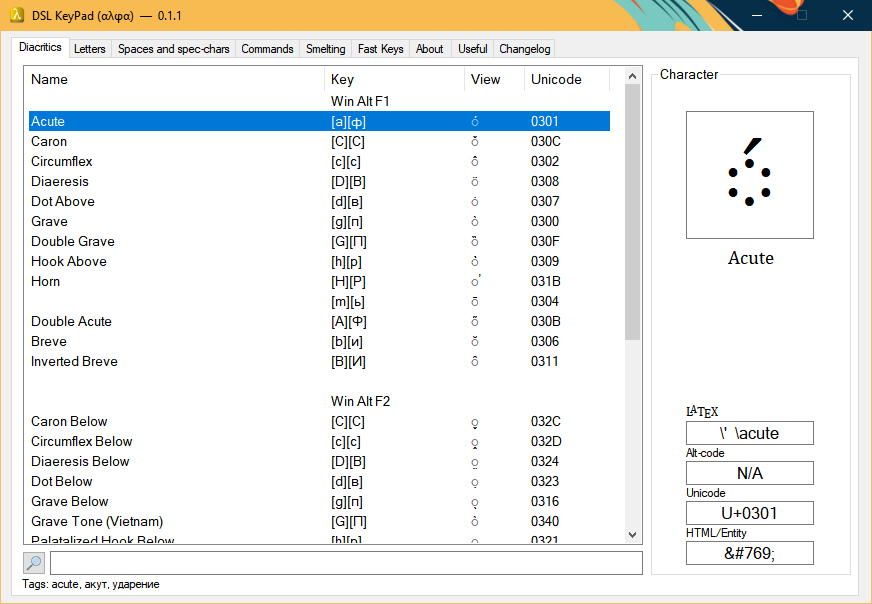
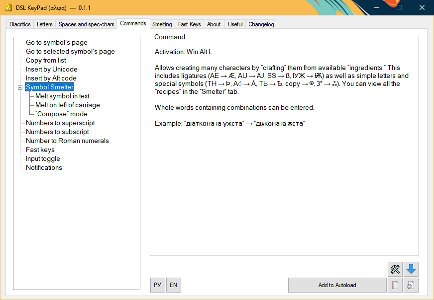
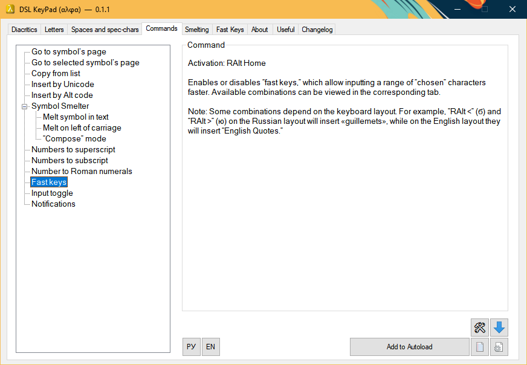
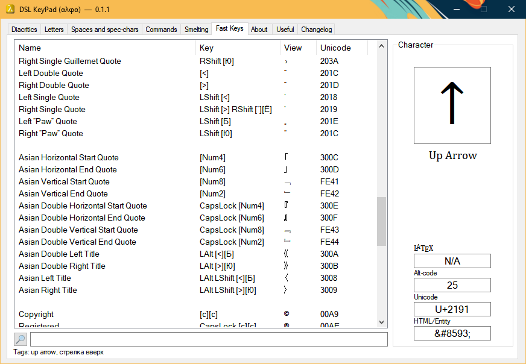

# DSL KeyPad \*in dev

## In English

This utility allows you to input a wide range of various symbols without the need to use “character maps” or other sources for copying. It includes diacritical marks (◌́◌̋◌̆◌̑◌̀◌̏◌̄◌̱), space/spacing variations (&#8198;<ins>&emsp;</ins> <ins>&ensp;</ins>&emsp13;<ins> </ins>&emsp14;<ins> </ins>&thinsp;<ins>&#8198;</ins>&#8198;) and dashes/hyphens (⸻, ⸺, —, –, ‐), quotation marks («Русские „Кавычки“», “English ‘Quotation Marks’”, „«Ghilimele» Românești”,「東アジアの『引用符』」), punctuation marks (…, ¡, ¿, ⁉, ⁈, ‼, ⁇, ‽, ⸘), ligatures (ꜲÆꜶꜸꜴꜼƢꝠꙖꙒ), letters (ĂÂǍɃḈðɆǶÞǷꝹѪѦЄҴ), currencies (₽¥₩€£₸₪), and special symbols (§′″°∞≠≈×−±⁑⁂†‡‰‱←↓↑→↺↻⮌⮏⮍⮎250⁄250), typically unavailable on a keyboard. You can view the full list of symbols in the *Panel*, which can be opened with <kbd>Win Alt Home</kbd>, or from the tray menu options.

## Input Methods

- **Groups** — the primary method, covering diacritical marks, spaces, dashes/hyphens, quotation marks, and special symbols. You need to activate a group of symbols and then press the key corresponding to the desired character. For example, <kbd>Win Alt F1</kbd> activates the "Basic Diacritics Group", after which pressing “a” will input the acute accent [á] or “m” will input a macron [m̄]. There are eight groups in total: Diacritics (<kbd>F1</kbd>, <kbd>F2</kbd>, <kbd>F3</kbd>, <kbd>F6</kbd>), Special Symbols (<kbd>F7</kbd>), Spaces (<kbd>Space</kbd>), Dashes (<kbd>-</kbd>), and Quotes (<kbd>"</kbd>).

- **Fast Keys** — uses <kbd>LCtrl LAlt</kbd>, <kbd>LAlt</kbd>, or <kbd>RAlt</kbd> as “initial” keys for quick access to chosen symbols. It includes more symbols than the “Groups”.

  Diacritical marks are mostly accessed through <kbd>LCtrl LAlt</kbd> combinations. For example, the same acute accent and macron can be entered using <kbd>LCtrl LAlt a</kbd> and <kbd>LCtrl LAlt m</kbd>, respectively.

  <kbd>RAlt</kbd> combinations are primarily used for letters and special symbols. For example, <kbd>RAlt E</kbd> on an English layout will type “Ĕ”, and on a Russian layout “Ѫ”. The combination <kbd>RAlt A</kbd> types “Ă” or “Ѳ” depending on the layout. Additionally, there are a few "simple combinations" — <kbd>NumpadSub</kbd> will insert the minus sign (−) instead of the hyphen-minus (-), and <kbd>NumpadAdd NumpadSub</kbd> will insert the plus-minus symbol (±).

  **Note:** This function is disabled by default and can be enabled with **RAlt Home**.

- **"Smelter"** — converts a sequence of characters (“recipe”) into another character, allowing the creation of ligatures (“AE” → “Æ”, “ІѪ” → “Ѭ”), accented letters (“Ă” *two characters* → “Ă” _one character_), or even letters (“ПС” → “Ѱ”, “КС” → “Ѯ”, “ДЖ” → “Џ”) and other symbols (“+−” → “±”, “\*\*\*” → “⁂”, “YEN” → “¥”, “°C” *two characters* → “℃” _one character_).

  The Smelter has four ways to use it:

  - Through the pop-up window, <kbd>Win Alt L</kbd>.
  - In text via recipe selection, <kbd>RShift L</kbd>.
  - In text, by placing the caret cursor after the recipe, <kbd>RShift Backspace</kbd>.
  - In “Compose” mode — allows you to "fuse" characters during typing, <kbd>RAlt×2</kbd>. It immediately inserts the first exact match for the entered sequence. There is an option to enable/disable waiting with <kbd>PauseBreak</kbd> (as some recipes start the same way), so “Compose” will not immediately insert the first match.

## Input Layout Alternatives

<kbd>Win Alt RCtrl</kbd> switches input from Russian/English to Glagolitic/Scandinavian runes. Pressing <kbd>А</kbd><kbd>Б</kbd> or <kbd>RAlt Ф</kbd>, for example, will input Ⰰ, Ⰱ, or Ⱚ, while pressing <kbd>A</kbd>, <kbd>W</kbd>, <kbd>F</kbd> will input ᚨ, ᚠ, ᚹ.

## Auxiliary Functions

- Insert a character by Unicode ID or Alt-code, <kbd>Win Alt <kbd>U</kbd>/<kbd>A</kbd></kbd>.
- Insert a character by its internal tag in the utility, <kbd>Win Alt F</kbd>.
- Convert numbers into Roman Numerals (“17489” → “ↂↁⅯⅯⅭⅭⅭⅭⅬⅩⅩⅩⅨ”) or superscript/subscript digits, <kbd>Win RAlt <kbd>3</kbd>/<kbd>1</kbd>/<kbd>2</kbd></kbd>.
- Switch between input methods (Character → HTML Code/Mnemonic → LaTeX → Character), <kbd>RAlt RShift Home</kbd>. If you switch input from "Character" to "HTML", the corresponding code will be entered, for example, instead of quotes “”, _\&ldquo;\&rdquo;_ will be entered, or instead of Æ → *\&AElig;*.

  **Note:** LaTeX codes are not available for all characters, and some codes are from external packages (which are listed above the LaTeX code in the Panel).

- Text Processors:

  - “Quotationizing” — wraps selected text in quotation marks (depending on the active layout): Gaius Tiberius, Executioner of the Gauls → “Gaius Tiberius, Executioner of the Gauls”, or Gaius Tiberius, “Executioner of the Gauls” → “Gaius Tiberius, ‘Executioner of the Gauls’”.

  - “GREP”-Replacements — replaces regular spaces in the selected text with their variants, for example, non-breaking spaces after one/two-letter words (а, в, не) and some three-letter words (для), or in numbers (1 000, 10 000, 100 000...); thin spaces in initials (I. O. Surname); and so on.

    **Note:** Based on typography rules for Russian.

  - Paragraph indentation — adds an Em-space at the beginning of paragraphs to simulate first-line indentation. This is especially useful for places where you cannot create paragraph indentation in a “civilized” way. Additionally, in paragraphs starting with an em-dash (russian dialogue paragraphs), it replaces the space after the dash with a en-space.

## Limitations

The utility can be used _(reliably)_ only on English or Russian layouts (including [the “Typography Layout”](https://ilyabirman.net/typography-layout/)), as it is based specifically on their keys for combinations. The use of “Fast Key” combinations outside these layouts is ignored, but “Groups” remain available.

## Installation

To use “DSL KeyPad”, simply [download the .ahk file](https://github.com/DemerNkardaz/DSL-KeyPad/blob/main/Install.KeyPad.ahk) and run it. The main file of the utility will be downloaded to the location where you run the “installer”, and the other files will be placed in “My Documents\DSLKeyPad”.

## На русском

Эта утилита позволяет вводить широкий спектр различных символов без надобности использования «карт символов» или других источников для копирования. Она включает в себя диакритические знаки (◌́◌̋◌̆◌̑◌̀◌̏◌̄◌̱), разновидности пробелов/шпаций (&#8198;<ins>&emsp;</ins> <ins>&ensp;</ins>&emsp13;<ins> </ins>&emsp14;<ins> </ins>&thinsp;<ins>&#8198;</ins>&#8198;) и тире/дефисов (⸻, ⸺, —, –, ‐), кавычки («Русские „Кавычки“», “English ‘Quotation Marks’”, „«Ghilimele» Românești”,「東アジアの『引用符』」), пунктуацию (…, ¡, ¿, ⁉, ⁈, ‼, ⁇, ‽, ⸘), лигатуры (ꜲÆꜶꜸꜴꜼƢꝠꙖꙒ), буквы (ĂÂǍɃḈðɆǶÞǷꝹѪѦЄҴ), валюты (₽¥₩€£₸₪) и специальные символы (§′″°∞≠≈×−±⁑⁂†‡‰‱←↓↑→↺↻⮌⮏⮍⮎250⁄250), обычно недоступные на клавиатуре. С полным перечнем символов можно ознакомиться в *Панели*, открывающуюся комбинацией <kbd>Win Alt Home</kbd> или в пунктах меню в трее.

## Методы ввода

- **Группы** — базовый метод, включающий диакритические знаки, пробелы, тире/дефисы, кавычки и специальные символы. Необходимо активировать группу символов, а затем нажать на кнопку нужного знака, например: <kbd>Win Alt F1</kbd> активирует «Основную группу диакритики», после чего можно нажать на «ф(a)» для ввода акута [á] или «ь(m)» для ввода макрона [m̄]. Всего групп восемь: Диакритика (F1, F2, F3, F6), Специальные символы (F7), Шпации (Пробел), Тире (-) и Кавычки (").
- **Быстрые ключи** — использует <kbd>LCtrl LAlt</kbd>, <kbd>LAlt</kbd> или <kbd>RAlt</kbd> в качестве «начальных» клавиш комбинаций для ускоренного ввода избранных символов. Включает в себя больше символов, чем «группы».

  Диакритические знаки в основном располагаются в комбинациях с <kbd>LCtrl LAlt</kbd> Ввод, например, тех же акута и макрона, осуществляется комбинациями<kbd>LCtrl LAlt a</kbd> и <kbd>LCtrl LAlt m</kbd>

  Комбинации с <kbd>RAlt</kbd> в основном служат для ввода букв и специальных символов: <kbd>RAlt E</kbd> на английском раскладке введёт «Ĕ», а на русской «Ѫ». Комбинация <kbd>RAlt A</kbd> «Ă» или «Ѳ» соответственно. Имеется и небольшое количество «простых комбинаций» — <kbd>NumpadSub</kbd> вместо дефисо‐минуса (-) будет вводить знак минуса (−), а комбинация <kbd>NumpadAdd NumpadSub</kbd> введёт плюс-минус (±).

  **Примечание:** по умолчанию функция отключена, и её можно активировать комбинацией <kbd>RAlt Home</kbd>.

- **«Плавильня»** — конвертирует последовательность знаков («рецепт») в другой знак, что позволяет получать лигатуры («AE» → «Æ», «ІѪ» → «Ѭ»), акцентные буквы («Ă» *два символа* → «Ă» _единый символ_) или просто буквы («ПС» → «Ѱ», «КС» → «Ѯ», «ДЖ» → «Џ») и прочие символы («+−» → «±», «\*\*\*» → «⁂», «YEN» → «¥», «°C» *два символа* → «℃» _единый символ_).

  Плавильня включает в себя четыре способа её использовать:

  - Через всплывающее окно, <kbd>Win Alt L</kbd>.
  - В тексте через выделение рецепта, <kbd>RShift L</kbd>.
  - В тексте, установив курсор каретки после рецепта, <kbd>RShift Backspace</kbd>.
  - Режиме «Compose» — даёт возможность использовать «сплавку» знаков прямо при вводе, <kbd>RAlt×2</kbd>. Сразу вставляет в поле ввода первое точное совпадение с вводимой последовательностью. Есть возможность включить/отключить ожидание через <kbd>PauseBreak</kbd> (так как ряд рецептов начинаются одинакого), и «Compose» не будет сразу вставлять первое совпадение.

## Альтернативные раскладки ввода

<kbd>Win Alt RCtrl</kbd> активирует переключение ввода с Русского/Английского на ввод Глаголицы/Скандинавских рун. Нажатие <kbd>А</kbd><kbd>Б</kbd> или <kbd>RAlt Ф</kbd>, например, введёт Ⰰ, Ⰱ или Ⱚ, а нажатие <kbd>A</kbd>,<kbd>W</kbd>,<kbd>F</kbd> введёт ᚨ, ᚠ, ᚹ.

## Вспомогательные функции

- Вставка символа по ID Юникода или по Alt‐коду, <kbd>Win Alt <kbd>U</kbd>/<kbd>A</kbd></kbd>.
- Вставка символа по внутреннему тегу в утилите, <kbd>Win Alt F</kbd>.
- Конвертация числа в Римские Цифры («17489» → «ↂↁⅯⅯⅭⅭⅭⅭⅬⅩⅩⅩⅨ») или в надстрочные/подстрочные цифры, <kbd>Win RAlt <kbd>3</kbd>/<kbd>1</kbd>/<kbd>2</kbd></kbd>.
- Изменение ввода «Символ → HTML‐код/Мнемоника → LaTeX → Символ», <kbd>RAlt RShift Home</kbd>. Если переключить ввод с «Символ» на «HTML», тогда будет вводиться соответствующий код, например: вместо кавычек «» будет введено _\&laquo;\&raquo;_, или вместо Ѫ → *\&#1130;*.

  **Примечание:** LaTeX коды доступны не для всех символов, а некоторые коды указаны из подключаемых пакетов (которые указываются над кодом LaTeX в Панели).

- Обработчики текста:

  - «Кавычкизация» — обрамляет выделенный текст кавычками (в зависимости от активной раскладки): Гай Тиберий, Палач Галлов → «Гай Тиберий, Палач Галлов», или Гай Тиберий, «Палач Галлов» → «Гай Тиберий, „Палач Галлов“».
  - «GREP»‐Замены — заменяет обычные пробелы в выделенном тексте его разновидностями, например неразрывным пробелом после одно‐/двубуквенных слов (а, в, не) и некоторых трёхбуквенных (для), в цифрах (1 000, 10 000, 100 000…); узким пробелом в инициалах (И. О. Фамилия); и т.д.

    **Примечание:** основано на типографике для русского языка.

  - Отбивка отступа абзаца — добавляет в начало абзацев выделенного текста Круглую шпацию для «симуляции красной строки». Больше необходимо для тех мест, где технически нельзя создать абзацный отступ иным «цивилизованным» образом. Так же в абзацах, начинающихся с длинного тире (диалоговые абзацы) заменяет пробел после данного тире на полукруглую шпацию.

## Ограничения

Утилита может быть использована _(стабильно)_ только на Английской или Русскоязычной раскладках (включая и [«Типографскую раскладку»](https://ilyabirman.ru/typography-layout/)), так как основывается именно на их клавишах для комбинаций. Использование комбинаций «Быстрых ключей» за пределами этих раскладок игнорируется, однако «Группы» остаются доступными.

## Установка

Для использования «DSL KeyPad» требуется просто [скачать .ahk файл](https://github.com/DemerNkardaz/DSL-KeyPad/blob/main/Install.KeyPad.ahk) и запустить. Основной файл утилиты будет скачан туда же, где вы запустите «установщик», остальные файлы попадут в «Мои Документы\DSLKeyPad».

---

# License

All own code source (i.e. exclude third-party code parts) is licensed under the [MIT License](https://github.com/DemerNkardaz/DSL-KeyPad/blob/main/LICENSE)
