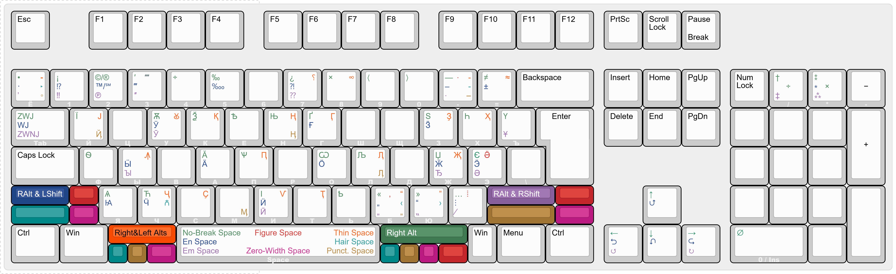

# DSL KeyPad \*αλφα, version in dev


   

# Contents

- [Overview](#overview)
  - [Input Methods](#input-methods)
  - [Alternative Layouts](#alternative-layouts)
  - [Auxiliary Features](#auxiliary-features)
  - [Limitations](#limitations)
  - [Installation](#installation)
- [Обзор](#обзор)
  - [Методы ввода](#методы-ввода)
  - [Альтернативные раскладки](#альтернативные-раскладки)
  - [Вспомогательные функции](#вспомогательные-функции)
  - [Ограничения](#ограничения)
  - [Установка](#установка)

# Overview

This utility allows you to input a wide range of various symbols without the need to use “character maps” or other sources for copying. It includes diacritical marks (◌́◌̋◌̆◌̑◌̀◌̏◌̄◌̱), space/spacing variations (&#8198;<ins>&emsp;</ins> <ins>&ensp;</ins>&emsp13;<ins> </ins>&emsp14;<ins> </ins>&thinsp;<ins>&#8198;</ins>&#8198;) and dashes/hyphens (⸻, ⸺, —, –, ‐), quotation marks («Русские „Кавычки“», “English ‘Quotation Marks’”, „«Ghilimele» Românești”,「東アジアの『引用符』」), punctuation marks (…, ¡, ¿, ⁉, ⁈, ‼, ⁇, ‽, ⸘), ligatures (ꜲÆꜶꜸꜴꜼƢꝠꙖꙒ), letters (ĂÂǍɃḈðɆǶÞǷꝹѪѦЄҴ), currencies (₽¥₩€£₸₪), and special symbols (§′″°∞≠≈×−±⁑⁂†‡‰‱←↓↑→↺↻⮌⮏⮍⮎250⁄250), typically unavailable on a keyboard. You can view the full list of symbols in the *Panel*, which can be opened with <kbd>Win Alt Home</kbd>, or from the tray menu options.

Note: use it on pair QWERTY‐ЙЦУКЕН of English & Russian layouts, compatibility with another not provided.

## Input Methods

- **Groups** — the primary method, covering diacritical marks, spaces, dashes/hyphens, quotation marks, and special symbols. You need to activate a group of symbols and then press the key corresponding to the desired character. For example, <kbd>Win Alt F1</kbd> activates the "Basic Diacritics Group", after which pressing “a” will input the acute accent [á] or “m” will input a macron [m̄]. There are eight groups in total: Diacritics (<kbd>F1</kbd>, <kbd>F2</kbd>, <kbd>F3</kbd>, <kbd>F6</kbd>), Special Symbols (<kbd>F7</kbd>), Spaces (<kbd>Space</kbd>), Dashes (<kbd>-</kbd>), and Quotes (<kbd>"</kbd>).

- **Fast Keys** — uses <kbd>LCtrl LAlt</kbd>, <kbd>LAlt</kbd>, or <kbd>RAlt</kbd> as “initial” keys for quick access to chosen symbols. It includes more symbols than the “Groups”.

  Diacritical marks are mostly accessed through <kbd>LCtrl LAlt</kbd> combinations. For example, the same acute accent and macron can be entered using <kbd>LCtrl LAlt a</kbd> and <kbd>LCtrl LAlt m</kbd>, respectively.

  <kbd>RAlt</kbd> combinations are primarily used for letters and special symbols. For example, <kbd>RAlt E</kbd> on an English layout will type “Ĕ”, and on a Russian layout “Ѫ”. The combination <kbd>RAlt A</kbd> types “Ă” or “Ѳ” depending on the layout. Additionally, there are a few "simple combinations" — <kbd>NumpadSub</kbd> will insert the minus sign (−) instead of the hyphen-minus (-), and <kbd>NumpadAdd NumpadSub</kbd> will insert the plus-minus symbol (±).

  **Note:** This function is disabled by default and can be enabled with **RAlt Home**.

- **“Forge”** — converts a sequence of characters (“recipe”) into another character, allowing the creation of ligatures (“AE” → “Æ”, “ІѪ” → “Ѭ”), accented letters (“Ă” *two characters* → “Ă” _one character_), or even letters (“ПС” → “Ѱ”, “КС” → “Ѯ”, “ДЖ” → “Џ”) and other symbols (“+−” → “±”, “\*\*\*” → “⁂”, “YEN” → “¥”, “°C” *two characters* → “℃” _one character_).

  The Forge has four ways to use it:

  - Through the pop-up window, <kbd>Win Alt L</kbd>.
  - In text via recipe selection, <kbd>RShift L</kbd>.
  - In text, by placing the caret cursor after the recipe, <kbd>RShift Backspace</kbd>.
  - In “Compose” mode — allows you to "fuse" characters during typing, <kbd>RAlt×2</kbd>. It immediately inserts the first exact match for the entered sequence. There is an option to enable/disable waiting with <kbd>PauseBreak</kbd> (as some recipes start the same way), so “Compose” will not immediately insert the first match.

## Alternative Layouts

<kbd>RCtrl 1</kbd> switches input from Russian/English to Glagolitic/Germanic‐Norse, Anglo‐Saxon runes. Pressing <kbd>А</kbd><kbd>Б</kbd> or <kbd>RAlt Ф</kbd>, for example, will input Ⰰ, Ⰱ, or Ⱚ, while pressing <kbd>A</kbd>, <kbd>W</kbd>, <kbd>F</kbd> will input ᚨ, ᚹ, ᚠ.

<kbd>RCtrl 2</kbd> similarly activates the input of Old Turkic and Old Permic scripts, “𐱃𐰞𐰤𐰪𐰅𐰺” “”. Old Permic requires the [Noto Sans Old Permic](https://fonts.google.com/noto/specimen/Noto+Sans+Old+Permic) font.

<kbd>RCtrl 4</kbd> activates the input of Gothic script, “𐌱𐌴𐍂𐌺𐌰𐌹𐌽𐌰 𐍉𐌸𐌰𐌻𐌰 𐍅𐌿𐌽𐌾𐌰 𐍄𐍅𐌶”.

## Auxiliary Features

- Insert a character by Unicode ID or Alt-code, <kbd>Win Alt <kbd>U</kbd>/<kbd>A</kbd></kbd>.
- Insert a character by its internal tag in the utility, <kbd>Win Alt F</kbd>.
- Convert numbers into Roman Numerals (“17489” → “ↂↁⅯⅯⅭⅭⅭⅭⅬⅩⅩⅩⅨ”) or superscript/subscript digits, <kbd>Win RAlt <kbd>3</kbd>/<kbd>1</kbd>/<kbd>2</kbd></kbd>.
- Switch between input methods (Character → HTML Code/Mnemonic → LaTeX → Character), <kbd>RAlt RShift Home</kbd>. If you switch input from "Character" to "HTML", the corresponding code will be entered, for example, instead of quotes “”, _\&ldquo;\&rdquo;_ will be entered, or instead of Æ → *\&AElig;*.

  **Note:** LaTeX codes are not available for all characters, and some codes are from external packages (which are listed above the LaTeX code in the Panel).

- Text Processors:

  - “Quotationizing” — wraps selected text in quotation marks (depending on the active layout): Gaius Tiberius, Executioner of the Gauls → “Gaius Tiberius, Executioner of the Gauls”, or Gaius Tiberius, “Executioner of the Gauls” → “Gaius Tiberius, ‘Executioner of the Gauls’”.

  - “GREP”-Replacements — replaces regular spaces in the selected text with their variants, for example, non-breaking spaces after one/two-letter words (а, в, не) and some three-letter words (для), or in numbers (1 000, 10 000, 100 000...); thin spaces in initials (I. O. Surname); and so on.

    **Note:** Based on typography rules for Russian.

  - Paragraph indentation — adds an Em-space at the beginning of paragraphs to simulate first-line indentation. This is especially useful for places where you cannot create paragraph indentation in a “civilized” way. Additionally, in paragraphs starting with an em-dash (russian dialogue paragraphs), it replaces the space after the dash with a en-space.

## Limitations

The utility can be used _(reliably)_ only on English or Russian layouts (including [the “Typography Layout”](https://ilyabirman.net/typography-layout/)), as it is based specifically on their keys for combinations. The use of “Fast Key” combinations outside these layouts is ignored, but “Groups” remain available.

## Installation

To use “DSL KeyPad”, simply [download the .ahk file](https://github.com/DemerNkardaz/DSL-KeyPad/blob/main/Install.KeyPad.ahk), run it and choose where utility will be installed.

# Обзор

«DSL KeyPad» — утилита на языке [AutoHotkey 2.0](https://www.autohotkey.com/) для ввода спектра символов юникода посредством горячих клавиш и вспомогательных функций. Основное направление — расширение возможностей для ввода латиницы и кириллицы, а в будущем возможно расширение и на греческие символы.


### Латиница

Утилита поддерживает ввод большинства символов латиницы, включая их вариации (комбинируемые, надстрочные, подстрочные, математические). Имея лишь базовую US раскладку возможно письмо на множестве языков/систем (включая исторических) на основе латиницы, например:

- [Limba Românească](https://ru.wikipedia.org/wiki/Румынский_язык): Țara, Învăța, Șase.
- [Gagauzça](https://ru.wikipedia.org/wiki/Гагаузский_язык): Sölzlük, Harţaklı, Sürçmää.
- [Ænglisċ](https://ru.wikipedia.org/wiki/Древнеанглийский_язык): Ƿeorðmyndum, Æġhƿylc, Þeod.
- [Norrœnt Mál](https://ru.wikipedia.org/wiki/Древнескандинавский_язык): Þrúðvangar, Mjǫðr, Kvæði.
- [Norsk](https://ru.wikipedia.org/wiki/Норвежский_язык): Høvåg, Ærlig, Skatteøya.
- [Deutsch](https://ru.wikipedia.org/wiki/Немецкий_язык): Straße, Österreich, Süß.
- [Français](https://ru.wikipedia.org/wiki/Французский_язык): Déjà, Sœur, Laïque.
- [Malti](https://ru.wikipedia.org/wiki/Мальтийский_язык): Għaqda, Iżda, Oċean.
- [Español](https://ru.wikipedia.org/wiki/Испанский_язык): ¿Cuántos años…, Éxito, Corazón.
- [Język polski](https://ru.wikipedia.org/wiki/Польский_язык): Wiedźmin, Żołnierz, Natknąć się.
- [Čeština](https://ru.wikipedia.org/wiki/Чешский_язык): Zřetelně, Výpůjčka, Vyvíjí.
- [Latviešu valoda](https://ru.wikipedia.org/wiki/Латышский_язык): Katoļu ticību, Luterāņu katķisma.
- [ Tiếng Việt](https://ru.wikipedia.org/wiki/Вьетнамский_язык): Thương Ưởng, Đế Chế, Rồng phương Bắc.<br>&emsp;Для облегчения письма присутствует Vietnamese TELEX/VNI‐подобный режим ввода: <kbd>RAlt F2</kbd>
- [ Hànyǔ Pīnyīn「汉语拼音」](https://ru.wikipedia.org/wiki/Пиньинь): MÄo「貓」, Gǔ「谷」, GÅngtíng「宮廷」.<br>&emsp;Аналогично присутствует Vietnamese TELEX/VNI‐подобный режим ввода: <kbd>RAlt RShift F2</kbd>

[Здесь](https://github.com/DemerNkardaz/DSL-KeyPad/wiki/Languages-Input〈Fast-Keys-%25-Compose〉) представлен перечень таблиц‐подсказок для многоязычного ввода.


### Кириллица

Поддерживается и множество кириллических символов, требующих наличие обычной русскоязычной раскладки. Как и в случае с латиницей, возможно письмо на ряде языков (включая исторических) с кириллическим алфавитом, например:

- [Словѣньскъ ѩзꙑкъ](https://ru.wikipedia.org/wiki/Старославянский_язык): Благоѫханиѥ, Бєꙁѹмьникъ, Єѵрѡпа.
- [Лимба Рѹмѫнѣскъ](https://ru.wikipedia.org/wiki/Старорумынский_язык): Ꙟвъца.
- [Беларуская мова](https://ru.wikipedia.org/wiki/Белорусский_язык): Драўніна, Ўніверсітэт.
- [Українська мова](https://ru.wikipedia.org/wiki/Украинский_язык): Поїзд, Білий, Євангеліє.
- [Црногорски језик](https://ru.wikipedia.org/wiki/Черногорский_язык): Ђетић, Ђевојка, Коштањ.
- [Македонски јазик](https://ru.wikipedia.org/wiki/Македонский_язык): Џоконда, Луѓе, Одењето.
- [Қазақ тілі](https://ru.wikipedia.org/wiki/Казахский_язык): Мәліметтер, Ыңғай, Көз.
- [Забони тоҷикӣ](https://ru.wikipedia.org/wiki/Таджикский_язык): Дӯстон, Баҳри.


### Греческий

На данный момент отдельной поддержки для греческого языка и языков на основе греческого письма нет. Однако имеются мысли о её вводе в будущем.<br><br>

---


### Пунктуация

Дополнительно ко вводу букв, поддерживается и ввод множества символов для пунктуации на различных языках, например:

| Символы                | Пример                                                                                                                                                          |
| ---------------------- | --------------------------------------------------------------------------------------------------------------------------------------------------------------- |
| ! ‼ ⁉ ¡ ? ⁇ ¿ ⸮ ⁈ ‽ ⸘  | ¿En qué dirección están las montañas? <br> ¡Madre mía, esto es un descubrimiento increíble!                                                                     |
| … ⁚ ⁝ ⁞ ·              | Диапазон чисел: −15…17,3 ℃                                                                                                                                      |
| ‐ ‑ — – ⸻ ⸺ ‒ ‧        | Диапазон чисел: 15–17,3 ℃ <br> — Ёримаса, стой! — воскликнул Тадахиса. <br> “Yorimasa, stop!” — Tadahisa exclaimed.                                             |
| «» ‹› “” ‘’ „” „“ „⹂ ‚ | Организация «НВК „Рассвет“» отправила экспедицию. <br> The “SMC ‘Dawn’” organization sent an expedition. <br> Organizația „CȘM «Răsărit»” a trimis o expediție. |


### Комбинируемая диакритика

Одна из первых категорий символов, добавленных в утилиту. Включает множество «основных» диакритических знаков, комбинируемых с другими символами и используется в ряде функций утилиты для получения акцентных букв, например, в режиме «Compose»: <kbd>RAlt×2</kbd>, `A` + ◌̆ + ◌́ = `Ắ`.


<br>


### Шпации

Вторая из добавленных в утилиту категория символов. Включает почти все разновидности пробелов:

| Название                          | Ширина пробела              |
| --------------------------------- | --------------------------- |
| Неразрывный пробел                | <ins>&nbsp;</ins>           |
| Круглая шпация                    | <ins>&emsp;</ins>           |
| Полукруглая шпация                | <ins>&ensp;</ins>           |
| Цифровой пробел                   | <ins>&numsp;</ins>          |
| 1⁄3 круглой шпации                | <ins>&emsp13;</ins>         |
| 1⁄4 круглой шпации                | <ins>&emsp14;</ins>         |
| 1⁄6 круглой шпации                | <ins>&#8198;</ins>          |
| Узкий пробел                      | <ins>&thinsp;</ins>         |
| Узкий неразрывный пробел          | <ins>&#8239;</ins>          |
| Волосяная шпация                  | <ins>&hairsp;</ins>         |
| Пунктуационный пробел             | <ins>&puncsp;</ins>         |
| Пробел нулевой ширины             | <ins>&ZeroWidthSpace;</ins> |
| Неразрывный пробел нулевой ширины | <ins>&#65279;</ins>         |
| Em‑Квадрат                        | <ins>&#8193;</ins>          |
| En‑Квадрат                        | <ins>&#8192;</ins>          |
| Соединитель слов                  | <ins>&NoBreak;</ins>        |

_Соединитель слов_ не является разновидностью пробела, но был добавлен вместе со шпациями в составе «одной группы».


### …и различные прочие символы

Включён и ряд других разных символов, как знаки валют, типографские, математические знаки, стрелки и так далее, например:

| Символы                                                                                                                                                     |
| ----------------------------------------------------------------------------------------------------------------------------------------------------------- |
| ←↑↓→↖↗↙↘↔↕↺↻⮌⮍⮏⮎ <br> ※ ⁑ ⁂ ⁎ † ‡ ⹋ § © 🄯 ℗ ™ ℠ ′ ″ ‴ ⁗ ° <br> ‰ ‱ ÷ × ⋇ − ± ∓ ≈ ∽ ≋ ∑ ⨋ ∏ ∪ ∫ ∬ ∰ ∆ ∇ ≤ ≧ <br> ₽ ₹ ₱ ₴ ¢ ₣ £ ₤ ₺ € ₳ ₶ ₩ ¥ 円 元 ₫ ₮ ₸ ₪ ₿ |

---

## Альтернативные режимы ввода

Режимы, которые активируются «поверх» английской и/или русской раскладок и представляют собой, в основном, различные виды письменностей.


### [Руническое письмо](https://ru.wikipedia.org/wiki/Руны)

Активация: <kbd>RCtrl 1</kbd><br>\[Английская раскладка\]

Включает практически все германские/англо‐саксонские рунические символы:

| Старший Футарк                                       | Футорк                                | Младший Футарк                                      | Средневековые | «Золотые числа» |
| ---------------------------------------------------- | ------------------------------------- | --------------------------------------------------- | ------------- | --------------- |
| ᚨ ᛒ ᛞ ᛖ ᚠ ᚷ ᚺ ᛁ ᛇ ᛃ ᚲ ᛚ ᛗ <br> ᚾ ᛜ ᛟ ᛈ ᚱ ᛊ ᛏ ᚦ ᚢ ᚹ ᛉ | …ᚪ ᚫ ᚳ ᛠ ᚸ ᚻ ᛄ ᛡ ᛤ ᛣ <br> ᛝ ᚩ ᛢ ᛋ ᛥ ᚣ | …ᛅ ᛆ ᛓ ᚼ ᚽ ᚴ ᛘ ᛙ ᚿ ᚬ ᚭ ᛌ <br> ᛐ ᚤ ᛦ ᛧ ᛨ ᛂ ᚧ ᛑ ᛛ ᛔ ᚡ | …ᛍ ᛀ ᚰ ᚮ ᛪ ᛎ  | …ᛮ ᛯ ᛰ          |


### [Глаголица](https://ru.wikipedia.org/wiki/Глаголица)

Активация: <kbd>RCtrl 1</kbd><br>\[Русская раскладка\]

Старославянская письменность; Включает как обычные символы, так и комбинируемые.

| Символы (не все)                                                                               |
| ---------------------------------------------------------------------------------------------- |
| Ⰰ Ⰱ Ⰲ Ⰳ Ⰴ Ⰵ Ⰶ Ⰷ Ⰸ Ⰹ Ⰺ Ⰻ Ⰼ Ⰽ Ⰾ Ⰿ Ⱀ Ⱁ Ⱂ Ⱃ Ⱄ Ⱅ Ⱛ Ⱆ Ⱇ Ⱈ Ⱉ Ⱊ Ⱌ Ⱍ Ⱎ Ⱋ Ⱏ (ⰟⰊ) Ⱐ Ⱑ Ⱖ Ⱒ Ⱓ Ⱔ Ⱗ Ⱘ Ⱙ Ⱚ Ⱜ Ⱝ |


### [Древнетюркское письмо](https://ru.wikipedia.org/wiki/Древнетюркское_письмо)

Активация: <kbd>RCtrl 2</kbd><br>\[Английская раскладка\] \[Письмо справа налево\]

_Орхоно‐енисейкое письмо_

| Орхонский репертуар                                                                      | Енисейский репертуар                                            |
| ---------------------------------------------------------------------------------------- | --------------------------------------------------------------- |
| 𐰀 𐰃 𐰆 𐰇 𐰲 𐰢 𐰭 𐰯 𐱁 𐰔 𐰡 𐰨 𐰪 𐰦 𐱈 𐰉 𐰋 𐰑 𐰓 𐰞 𐰠 𐰣 𐰤 𐰺 <br> 𐰼 𐰽 𐰾 𐱃 𐱅 𐰖 𐰘 𐰍 𐰏 𐰴 𐰚 𐰸 𐰜 𐰶 𐰱 𐰿 𐰰 𐱇 | …𐰁 𐰂 𐰅 𐰄 𐰈 𐰳 𐱂 𐰕 𐰩 𐰫 𐰧 𐰊 𐰌 𐰒 𐰟 𐰥 𐰻 𐱄 𐱆 𐰗 𐰙 𐰎 <br> 𐰐 𐰵 𐰛 𐰹 𐰝 𐰷 𐱀 |


### [Древнепермское письмо](https://ru.wikipedia.org/wiki/Древнепермское_письмо)

Активация: <kbd>RCtrl 2</kbd><br>\[Русская раскладка\] \[Требует шрифт [Noto Sans Old Permic](https://fonts.google.com/noto/specimen/Noto+Sans+Old+Permic)\]

Старая письменность для языков коми.

| Символы (не все)                                                         |
| ------------------------------------------------------------------------ |
|  |


### [Секейское руническое письмо](https://ru.wikipedia.org/wiki/Секельское_руническое_письмо)

Активация: <kbd>RCtrl 3</kbd><br>\[Английская раскладка\] \[Письмо справа налево\] \[Требует шрифт [Noto Sans Old Hungarian](https://fonts.google.com/noto/specimen/Noto+Sans+Old+Hungarian)\]

Иначе — _«Венгерские руны»_

| Символы                                                                     |
| --------------------------------------------------------------------------- |
|  |


### [Готское письмо](https://ru.wikipedia.org/wiki/Готское_письмо)

Активация: <kbd>RCtrl 4</kbd><br>\[Английская раскладка\]

| Символы                                               |
| ----------------------------------------------------- |
| 𐌰 𐌱 𐌲 𐌳 𐌴 𐌵 𐌶 𐌷 𐌸 𐌹 𐌺 𐌻 𐌼 𐌽 𐌾 𐌿 𐍀 𐍁 𐍂 𐍃 𐍄 𐍅 𐍆 𐍇 𐍈 𐍉 𐍊 |


### [Древнеиталийское письмо](https://ru.wikipedia.org/wiki/Этрусский_алфавит)

Активация: <kbd>RCtrl 5</kbd><br>\[Английская раскладка\]

Символы древних алфавитов Апеннинского полуострова.

| Символы                                                                                                                                                                                                                                                                                                                                                        |
| -------------------------------------------------------------------------------------------------------------------------------------------------------------------------------------------------------------------------------------------------------------------------------------------------------------------------------------------------------------- |
| &#66304; &#66305; &#66306; &#66332; &#66307; &#66308; &#66349; &#66309; &#66330; &#66310; &#66311; &#66313; &#66333; &#66314; &#66329; &#66315; &#66316; &#66317; &#66319; &#66320; &#66328; &#66322; &#66323; &#66331; &#66324; &#66318; &#66321; &#66335; &#66325; &#66312; &#66326; &#66334; &#66327; &#66350; &#66351; &#66336; &#66337; &#66338; &#66339; |

<br>


### Математический режим и МФА

Активация: <kbd>RCtrl 9</kbd> / <kbd>RCtrl 0</kbd><br>\[Английская раскладка\]

Математический режим упрощает доступ ко множеству математических символов через клавиши A–Z, в то время как второй режим упрощает ввод символов Международного фонетического алфавита.

_Оба режима не завершены_

---

## Важные функции

### Группы активации

Ограниченный базовый метод ввода символов, требующий активировать «группу», а затем ввести символ‐ключ, например, <kbd>LWin LAlt F1</kbd> активирует первую группу диакритики, после чего ввод <kbd>m</kbd> вставит ◌̄, или ввод <kbd>M</kbd> → ◌̱ . Перечень ключей для каждой группы доступен на «Панели» во вкладках «Диакритика» и «Пробелы и спец‐символы».

Всего групп восемь:

| Группа                      | Активация                   |
| --------------------------- | --------------------------- |
| Первая группа диакритики    | <kbd>LWin LAlt F1</kbd>     |
| Вторая группа диакритики    | <kbd>LWin LAlt F2</kbd>     |
| Третья группа диакритики    | <kbd>LWin LAlt F3</kbd>     |
| Четвёртая группа диакритики | <kbd>LWin LAlt F6</kbd>     |
| Группа спецсимволов         | <kbd>LWin LAlt F7</kbd>     |
| Группа шпаций               | <kbd>LWin LAlt Пробел</kbd> |
| Группа дефисов и тире       | <kbd>LWin LAlt -</kbd>      |
| Группа кавычек              | <kbd>LWin LAlt "</kbd>      |

### «Быстрые ключи»

Активация: <kbd>RAlt F1</kbd> (запоминает состояние)

Основной метод ввода для множества символов латиницы, кириллицы, пукнтуации, шпаций и прочих знаков. Утилизирует <kbd>LAlt</kbd>, <kbd>LCtrl LAlt</kbd>, <kbd>RAlt</kbd>, <kbd>RShift</kbd> как стартовые модификаторы для комбинаций, например:

- <kbd>RAlt A</kbd> — Ă
- <kbd>RAlt RShift A</kbd> — Ā
- <kbd>RAlt LShift A</kbd> — Ä
- <kbd>RAlt LShift RShift A</kbd> — Ã
- <kbd>RAlt LAlt A</kbd> — Â
- <kbd>RAlt LAlt RShift A</kbd> — Ą
- <kbd>RAlt LAlt LShift A</kbd> — Å
- <kbd>LAlt A</kbd> — Á
- <kbd>RShift A</kbd> — À
- <kbd>RShift LShift A</kbd> — Ȁ

Так как «Быстрые ключи» регистрируют внушительное количество комбинаций, по умолчанию они отключены. Группировка комбинаций происходит по следующему принципу: <kbd>LCtrl LAlt</kbd> в «Быстрых ключах» отведены в основном под комбинируемую диакритику (за исключением <kbd>LCtrl LAlt - _или_ NumPad0</kbd>, дающим _мягкий перенос_ или ◌ соответственно), например — <kbd>LCtrl LAlt M</kbd> даст ◌̄, <kbd>… LShift D</kbd> — ◌̈ ; <kbd>RAlt</kbd> — основная клавиша для ввода прочих символов; <kbd>LAlt / RShift</kbd> используются по остаточному принципу — если, например, что‐то не влезло в <kbd>RAlt</kbd> — символы латиницы с акутом располагаются именно на комбинациях с <kbd>LAlt</kbd>, а с грависом — на комбинациях с <kbd>RShift</kbd>.

#### Простые комбинации

Небольшая группа биндов для нампада, не использующая указанные выше модификаторы:

| Комбинация                        | Символ               |
| --------------------------------- | -------------------- |
| <kbd>NumPad Sub</kbd> («-»)       | − (символ минуса)    |
| <kbd>NumPad Sub Add</kbd> («-+»)  | ∓                    |
| <kbd>NumPad Add Sub</kbd> («+-»)  | ±                    |
| <kbd>NumPad Div</kbd> («/»)       | ÷ (обелюс)           |
| <kbd>NumPad Mul</kbd> («\*»)      | × (символ умножение) |
| <kbd>NumPad Div Mul</kbd> («/\*») | ⋇                    |

#### Карты символов «Быстрых ключей»

<details>
	<summary>Латиница</summary>
<br>

**RAlt Комбинации**

<details>
	<summary>Пермассылка</summary>

```
https://www.keyboard-layout-editor.com/##@_css=* {%0A%20%20%20 font-size%2F: 11px%2F%3B%0A}%0A%0A.keylabel.keylabel10 > div {%0A%20%20%20 font-size%2F: 9px%2F%3B%0A%20%20%20 line-height%2F: 1em%2F%3B%0A%20%20%20 font-weight%2F: 800%2F%3B%0A%20%20%20 color%2F: %23eee%2F%3B%0A}%3B&@=Esc&_x:1%3B&=F1&=F2&=F3&=F4&_x:0.5%3B&=F5&=F6&=F7&=F8&_x:0.5%3B&=F9&=F10&=F11&=F12&_x:0.25%3B&=PrtSc&=Scroll Lock&=Pause%0ABreak%3B&@_y:0.5&t=%23407A52%0A%23875F9A%0A%23f74b03%0A%23a07432%0A%0A%0A%231F4788%0A%23008787%3B&=•%0A’%0A⁃%0A◦%0A~%0A%0A·%0A‣&_t=%23407A52%0A%23875F9A%0A%0A%0A%0A%0A%231F4788%3B&=¡%0A‼%0A%0A%0A1%0A%0A⁉&=©%2F%2F®%0A℗%0A%0A%0A2%0A%0A™%2F%2F℠&_t=%23407A52%0A%23875F9A%0A%0A%0A%0A%0A%231F4788%0A%0AC3272B%3B&=′%0A″%0A%0A%0A3%0A%0A‴%0A%0A⁗&_t=%23407A52%3B&=÷%0A%0A%0A%0A4&_t=%23407A52%0A%0A%0A%0A%0A%0A%231F4788%3B&=‰%0A%0A%0A%0A5%0A%0A‱&_t=%23000000&a:7%3B&=%0A%0A%0A%0A6&_t=%23407A52%0A%23875F9A%0A%23f74b03%0A%0A%0A%0A%231F4788&a:4%3B&=¿%0A⁇%0A⸮%0A%0A7%0A%0A⁈&_t=%23407A52%0A%0A%23f74b03%3B&=×%0A%0A∞%0A%0A8&_t=%23407A52%3B&=⟨%0A%0A%0A%0A9&=⟩%0A%0A%0A%0A0&_t=%23407A52%0A%23875F9A%0A%23f74b03%0A%23a07432%0A%0A%0A%231F4788%0A%23008787%0A%23C3272B%3B&=—%0A‧%0A‐%0A‒%0A-%0A%0A–%0A‑%0A‧&_t=%23407A52%0A%0A%23f74b03%0A%0A%0A%0A%231F4788%3B&=≠%0A%0A≈%0A%0A%2F=%0A%0A±&_t=%23000000&w:2%3B&=Backspace&_x:0.25%3B&=Insert&=Home&=PgUp&_x:0.25%3B&=Num Lock&_t=%23407A52%0A%23875F9A%3B&=†%0A‡%0A%0A%0A%2F%2F%0A%0A%0A%0A%0A÷&_t=%23407A52%0A%23875F9A%0A%0A%0A%0A%0A%231F4788%3B&=⁑%0A⁂%0A%0A%0A*%0A%0A⁎%0A%0A%0A×&_t=%23000000&a:7%3B&=−%0A%0A%0A%0A-%3B&@_t=%23407A52%0A%23875F9A%0A%0A%0A%0A%0A%231F4788&a:4&w:1.5%3B&=ZWJ%0AZWNJ%0A%0A%0ATab%0A%0AWJ&_t=%23000000%0A%23875F9A%0A%0A%0A%23ffffff%3B&=%0AɊ%0A%0A%0AQ&_t=%23407A52%0A%23875F9A%0A%23f74b03%0A%23a07432%0A%23ffffff%0A%0A%231F4788%0A%23008787%3B&=Ẇ%0AǷ%0AŴ%0AꟂ%0AW%0A%0AẄ%0AẈ&_t=%23407A52%0A%23875F9A%0A%23f74b03%0A%23a07432%0A%23ffffff%0A%0A%231F4788%0A%23008787%0A%23C3272B%3B&=Ə%0AĒ%0AÊ%0AĘ%0AE%0A%0AË%0AĚ%0AẼ&_t=%23407A52%0A%23875F9A%0A%23f74b03%0A%23a07432%0A%23ffffff%0A%0A%231F4788%0A%23008787%3B&=Ṙ%0AꝚ%0AṚ%0AŖ%0AR%0A%0AƦ%0AŘ&_t=%23407A52%0A%23875F9A%0A%23f74b03%0A%23a07432%0A%23ffffff%0A%0A%231F4788%0A%23008787%0A%23C3272B%3B&=Ț%0AÞ%0AṬ%0AŢ%0AT%0A%0AṪ%0AŤ%0A⹒&=Ẏ%0AȲ%0AŶ%0AỾ%0AY%0A%0AŸ%0AɎ%0AỸ&_t=%23407A52%0A%23875F9A%0A%23f74b03%0A%23a07432%0A%23ffffff%0A%0A%231F4788%0A%23008787%0A%23C3272B%0A%0A%23bb1b80%3B&=Ŭ%0AŪ%0AÛ%0AŲ%0AU%0A%0AÜ%0AŮ%0AŨ%0A%0AŰ&=Ĭ%0AĪ%0AÎ%0AĮ%0AI%0A%0AÏ%0AǏ%0AĨ%0A%0Aİı&=Ø%0AŌ%0AÔ%0AǪ%0AO%0A%0AÖ%0AǑ%0AÕ%0A%0AŐ&_t=%23407A52%0A%23875F9A%0A%23f74b03%0A%0A%23ffffff%0A%0A%231F4788%0A%23008787%3B&=Ṗ%0AƤ%0AꝔ%0A%0AP%0A%0AⱣ%0AꝒ&_t=%23000000%0A%0A%0A%0A%23ffffff&a:7%3B&=%0A%0A%0A%0A[&=%0A%0A%0A%0A]&_x:0.25&t=%23000000&a:4&w:1.25&h:2&w2:1.5&h2:1&x2:-0.25%3B&=Enter&_x:0.25%3B&=Delete&=End&=PgDn&_x:0.25&a:7%3B&=&=&=&_h:2%3B&=+%3B&@_a:4&w:1.75%3B&=Caps Lock&_t=%23407A52%0A%23875F9A%0A%23f74b03%0A%23a07432%0A%23ffffff%0A%0A%231F4788%0A%23008787%0A%23C3272B&f:4%3B&=Ă%0AĀ%0AÂ%0AĄ%0AA%0A%0AÄ%0AÅ%0AÃ&_f:3%3B&=Ș%0Aſ%0AŜ%0AŞ%0AS%0A%0Aẞ%0AŠ%0AƩ&_t=%23407A52%0A%0A%23f74b03%0A%23a07432%0A%23ffffff%0A%0A%0A%23008787%0A%23C3272B%3B&=ð%0A%0Ađ%0AḐ%0AD%0A%0A%0AĎ%0AḒ&_t=%23407A52%0A%0A%0A%0A%23ffffff%3B&=Ḟ%0A%0A%0A%0AF&_t=%23407A52%0A%23875F9A%0A%23f74b03%0A%23a07432%0A%23ffffff%0A%0A%231F4788%0A%23008787%0A%23C3272B%3B&=Ğ%0AḠ%0AĜ%0AĢ%0AG%0A%0AꝽ%0AǦ%0AƔ&_t=%23407A52%0A%0A%23f74b03%0A%23a07432%0A%23ffffff%0A%0A%231F4788%0A%23008787%3B&=Ħ%0A%0AĤ%0AḨ%0AH%0A%0AḦ%0AȞ&_t=%23407A52%0A%0A%23f74b03%0A%0A%23ffffff%0A%0A%0A%23008787%3B&=Ɉ%0A%0AĴ%0A%0AJ%0A%0A%0Aǰ&_t=%23000000%0A%0A%23f74b03%0A%23a07432%0A%23ffffff%0A%0A%0A%23008787%3B&=%0A%0AḲ%0AĶ%0AK%0A%0A%0AǨ&_t=%23407A52%0A%0A%0A%23a07432%0A%23ffffff%0A%0A%0A%23008787%0A%23C3272B%3B&=Ł%0A%0A%0AĻ%0AL%0A%0A%0AĽ%0AḼ&_t=%23000000%0A%0A%0A%0A%23ffffff&a:7%3B&=%0A%0A%0A%0A%2F%3B&=%0A%0A%0A%0A'&=%0A%0A%0A%0A\&_x:1.5&c=%23bb1b80&t=%23ffffff%0A%0A%0A%0A%0A%0A%23f0f0f0&a:4&w:2%3B&=R+L Alts +%0A%0A%0A%0A%0A%0AR+L Shifts&_c=%23008787&t=%23ffffff%3B&=R+L Alts%C2%A0+%0ALShift&_x:0.25&c=%23cccccc&t=%23000000&a:7%3B&=&=&=%3B&@_c=%231F4788&t=%23ffffff&a:4&w:2.25%3B&=RAlt + LShift&_c=%23cccccc&t=%23407A52%0A%23875F9A%0A%23f74b03%0A%0A%23ffffff%0A%0A%231F4788%0A%23008787%3B&=Ż%0AƷ%0AẐ%0A%0AZ%0A%0AƵ%0AŽ&_t=%23407A52%0A%0A%0A%0A%23ffffff%0A%0A%231F4788%3B&=Ẋ%0A%0A%0A%0AX%0A%0AẌ&_t=%23407A52%0A%0A%23f74b03%0A%23a07432%0A%23ffffff%0A%0A%0A%23008787%3B&=Ċ%0A%0AĈ%0AÇ%0AC%0A%0A%0AČ&_t=%23407A52%0A%23875F9A%0A%23f74b03%0A%0A%23ffffff%0A%0A%231F4788%0A%0A%23C3272B%3B&=Ꝟ%0AꝨ%0AṾ%0A%0AV%0A%0AỼ%0A%0AṼ&_t=%23407A52%0A%23875F9A%0A%23f74b03%0A%0A%23ffffff%0A%0A%231F4788%0A%23008787%3B&=Ḃ%0AƁ%0AḄ%0A%0AB%0A%0AɃ%0AꞖ&_t=%23407A52%0A%23875F9A%0A%23f74b03%0A%23a07432%0A%23ffffff%0A%0A%231F4788%0A%23008787%0A%23C3272B%3B&=Ñ%0AƝ%0AṆ%0AŅ%0AN%0A%0AꞐ%0AŇ%0AṄ&_t=%23407A52%0A%23875F9A%0A%23f74b03%0A%0A%23ffffff%3B&=Ṁ%0AⱮ%0AṂ%0A%0AM&_t=%23407A52%0A%23875F9A%0A%23f74b03%0A%23a07432%0A%23ffffff%0A%0A%231F4788%0A%23008787%0A%23C3272B%3B&=“%0A„%0A«%0A„%0A,%0A%0A‘%0A‹%0A‚&_t=%23407A52%0A%23875F9A%0A%23f74b03%0A%0A%23ffffff%0A%0A%231F4788%0A%23008787%3B&=”%0A⹂%0A»%0A%0A.%0A%0A’%0A›&_t=%23407A52%0A%23875F9A%0A%0A%0A%23ffffff%0A%0A%231F4788%0A%0A%23C3272B%3B&=…%0A⁄%0A%0A%0A%2F%2F%0A%0A⁝%0A%0A⁞&_c=%23875F9A&t=%23ffffff&w:2.75%3B&=RAlt + RShift&_x:0.25&c=%23C3272B%3B&=RAlt + L+R Shifts&_c=%23cccccc&t=407A52%0A%0A%0A%0A%0A%0A%231F4788%3B&=↑%0A%0A%0A%0A%0A%0A⮍&_c=%23a07432&t=%23ffffff%3B&=R+L Alts%C2%A0+%0ARShift&_x:0.25&c=%23cccccc&t=%23000000&a:7%3B&=&=&=&_h:2%3B&=%3B&@_a:4&w:1.25%3B&=Ctrl&_w:1.25%3B&=Win&_c=%23f74b03&w:1.25%3B&=RAlt + LAlt&_c=%23cccccc&t=%23407A52%0A%23875F9A%0A%23f74b03%0A%23a07432%0A%0A%0A%231F4788%0A%23008787%0A%23C3272B%0A%0A%23bb1b80&w:6.25%3B&=No-Break Space%0AEm Space%0AThin Space%0APunctuation Space%0ASpace%0A%0AEn Space%0AHair Space%0AFigure Space%0A%0AZero-Width Space&_c=%23407A52&t=%23f7f7f7&w:1.25%3B&=RAlt (AltGr)&_c=%23cccccc&t=%23000000&w:1.25%3B&=Win&_w:1.25%3B&=Menu&_w:1.25%3B&=Ctrl&_x:0.25&t=407A52%0A%23875F9A%0A%0A%0A%0A%0A%231F4788%3B&=←%0A↺%0A%0A%0A%0A%0A⮌&_t=407A52%0A%0A%0A%0A%0A%0A%231F4788%3B&=↓%0A%0A%0A%0A%0A%0A⮏&_t=407A52%0A%23875F9A%0A%0A%0A%0A%0A%231F4788%3B&=→%0A↻%0A%0A%0A%0A%0A⮎&_x:0.25&t=407A52&w:2%3B&=∅%0A%0A%0A%0A0 %2F%2F Ins&_t=%23000000&a:7%3B&=
```

</details>


</details>

<details>
	<summary>Кириллица</summary>

**RAlt Комбинации**

<details>
	<summary>Пермассылка</summary>

```
https://www.keyboard-layout-editor.com/##@_css=* {%0A%20%20%20 font-size%2F: 11px%2F%3B%0A}%0A%0A.keylabel.keylabel10 > div {%0A%20%20%20 font-size%2F: 9px%2F%3B%0A%20%20%20 line-height%2F: 1em%2F%3B%0A%20%20%20 font-weight%2F: 800%2F%3B%0A%20%20%20 color%2F: %23eee%2F%3B%0A}%3B&@=Esc&_x:1%3B&=F1&=F2&=F3&=F4&_x:0.5%3B&=F5&=F6&=F7&=F8&_x:0.5%3B&=F9&=F10&=F11&=F12&_x:0.25%3B&=PrtSc&=Scroll Lock&=Pause%0ABreak%3B&@_y:0.5&t=%23407A52%0A%23875F9A%0A%23f74b03%0A%23a07432%0A%0A%0A%231F4788%0A%23008787%3B&=•%0A’%0A⁃%0A◦%0AЁ%0A%0A·%0A‣&_t=%23407A52%0A%23875F9A%0A%0A%0A%0A%0A%231F4788%3B&=¡%0A‼%0A%0A%0A1%0A%0A⁉&=©%2F%2F®%0A℗%0A%0A%0A2%0A%0A™%2F%2F℠&_t=%23407A52%0A%23875F9A%0A%0A%0A%0A%0A%231F4788%0A%0AC3272B%3B&=′%0A″%0A%0A%0A3%0A%0A‴%0A%0A⁗&_t=%23407A52%3B&=÷%0A%0A%0A%0A4&_t=%23407A52%0A%0A%0A%0A%0A%0A%231F4788%3B&=‰%0A%0A%0A%0A5%0A%0A‱&_t=%23000000&a:7%3B&=%0A%0A%0A%0A6&_t=%23407A52%0A%23875F9A%0A%23f74b03%0A%0A%0A%0A%231F4788&a:4%3B&=¿%0A⁇%0A⸮%0A%0A7%0A%0A⁈&_t=%23407A52%0A%0A%23f74b03%3B&=×%0A%0A∞%0A%0A8&_t=%23407A52%3B&=⟨%0A%0A%0A%0A9&=⟩%0A%0A%0A%0A0&_t=%23407A52%0A%23875F9A%0A%23f74b03%0A%23a07432%0A%0A%0A%231F4788%0A%23008787%0A%23C3272B%3B&=—%0A‧%0A‐%0A‒%0A-%0A%0A–%0A‑%0A‧&_t=%23407A52%0A%0A%23f74b03%0A%0A%0A%0A%231F4788%3B&=≠%0A%0A≈%0A%0A%2F=%0A%0A±&_t=%23000000&w:2%3B&=Backspace&_x:0.25%3B&=Insert&=Home&=PgUp&_x:0.25%3B&=Num Lock&_t=%23407A52%0A%23875F9A%3B&=†%0A‡%0A%0A%0A%2F%2F%0A%0A%0A%0A%0A÷&_t=%23407A52%0A%23875F9A%0A%0A%0A%0A%0A%231F4788%3B&=⁑%0A⁂%0A%0A%0A*%0A%0A⁎%0A%0A%0A×&_t=%23000000&a:7%3B&=−%0A%0A%0A%0A-%3B&@_t=%23407A52%0A%23875F9A%0A%0A%0A%0A%0A%231F4788&a:4&w:1.5%3B&=ZWJ%0AZWNJ%0A%0A%0ATab%0A%0AWJ&_t=%23407A52%0A%0A%23f74b03%0A%23a07432%3B&=Ї%0A%0AЈ%0AҊ%0AЙ&_t=%23000000&a:7%3B&=%0A%0A%0A%0AЦ&_t=%23407A52%0A%23875F9A%0A%23f74b03%0A%0A%0A%0A%231F4788&a:4%3B&=Ѫ%0AӮ%0AꙊ%0A%0AУ%0A%0AӰ&_t=%23407A52%0A%0A%23f74b03%3B&=Ѯ%0A%0AҚ%0A%0AК&_t=%23407A52%3B&=Ѣ%0A%0A%0A%0AЕ&_t=%23407A52%0A%0A%23f74b03%0A%23a07432%3B&=Њ%0A%0AҢ%0AӉ%0AН&_t=%23407A52%0A%0A%23f74b03%0A%0A%0A%0A%231F4788%3B&=Ґ%0A%0AӶ%0A%0AГ%0A%0AҒ&_t=%23000000&a:7%3B&=%0A%0A%0A%0AШ&=%0A%0A%0A%0AЩ&_t=%23407A52%0A%0A%23f74b03%0A%0A%0A%0A%231F4788&a:4%3B&=Ѕ%0A%0AҘ%0A%0AЗ%0A%0AӞ&_t=%23407A52%0A%0A%23f74b03%3B&=Һ%0A%0AҲ%0A%0AХ&_t=%23407A52%0A%23875F9A%3B&=Ү%0AҰ%0A%0A%0AЪ&_x:0.25&t=%23000000&w:1.25&h:2&w2:1.5&h2:1&x2:-0.25%3B&=Enter&_x:0.25%3B&=Delete&=End&=PgDn&_x:0.25&a:7%3B&=&=&=&_h:2%3B&=+%3B&@_a:4&w:1.75%3B&=Caps Lock&_t=%23407A52%3B&=Ѳ%0A%0A%0A%0AФ&_t=%23407A52%0A%23875F9A%0A%23f74b03%0A%0A%0A%0A%231F4788%3B&=%0AꙐ%0AꙞ%0A%0AЫ%0A%0AӸ&_t=%23000000&a:7%3B&=%0A%0A%0A%0AВ&_t=%23407A52%0A%0A%0A%0A%0A%0A%231F4788&a:4%3B&=Ӑ%0A%0A%0A%0AА%0A%0AӒ&_t=%23407A52%0A%0A%23f74b03%3B&=Ѱ%0A%0AԤ%0A%0AП&_t=%23000000&a:7%3B&=%0A%0A%0A%0AР&_t=%23407A52%0A%0A%0A%0A%0A%0A%231F4788&a:4%3B&=Ѡ%0A%0A%0A%0AО%0A%0AӦ&_t=%23407A52%0A%0A%23f74b03%0A%23a07432%3B&=Љ%0A%0AԮ%0AӅ%0AЛ&_t=%23000000&a:7%3B&=%0A%0A%0A%0AД&_t=%23407A52%0A%23875F9A%0A%23f74b03%0A%0A%0A%0A%231F4788&a:4%3B&=Џ%0AЂ%0AҖ%0A%0AЖ%0A%0AӜ&_t=407A52%0A%23875F9A%0A%0A%0A%0A%0A%231F4788%0A%0A%23C3272B%3B&=Є%0AӘ%0A%0A%0AЭ%0A%0AӬ%0A%0AӚ&_t=%23000000&a:7%3B&=%0A%0A%0A%0A\&_x:1.5&c=%23bb1b80&t=%23ffffff%0A%0A%0A%0A%0A%0A%23f0f0f0&a:4&w:2%3B&=R+L Alts +%0A%0A%0A%0A%0A%0AR+L Shifts&_c=%23008787&t=%23ffffff%3B&=R+L Alts%C2%A0+%0ALShift&_x:0.25&c=%23cccccc&t=%23000000&a:7%3B&=&=&=%3B&@_c=%231F4788&t=%23ffffff&a:4&w:2.25%3B&=RAlt + LShift&_c=%23cccccc&t=%23407A52%0A%0A%0A%0A%0A%0A%231F4788%3B&=Ѧ%0A%0A%0A%0AЯ%0A%0AꙖ&_t=%23407A52%0A%0A%23f74b03%0A%0A%0A%0A%231F4788%0A%23008787%3B&=Ћ%0A%0AҶ%0A%0AЧ%0A%0AӴ%0AꙈ&_t=%23407A52%0A%0A%23f74b03%3B&=%0A%0AҪ%0A%0AС&_t=%23407A52%0A%0A%0A%23a07432%3B&=%0A%0A%0AӍ%0AМ&_t=%23407A52%0A%23875F9A%0A%23f74b03%0A%0A%0A%0A%231F4788%3B&=І%0AӢ%0AѴ%0A%0AИ%0A%0AӤ&_t=%23407A52%0A%0A%23f74b03%3B&=%0A%0AҬ%0A%0AТ&_t=%23407A52%3B&=Ҍ%0A%0A%0A%0AЬ&_t=%23407A52%0A%23875F9A%0A%23f74b03%0A%23a07432%0A%0A%0A%231F4788%0A%23008787%0A%23C3272B%3B&=«%0A„%0A“%0A„%0AБ%0A%0A„%0A‹%0A‚&_t=%23407A52%0A%23875F9A%0A%23f74b03%0A%0A%0A%0A%231F4788%0A%23008787%3B&=»%0A⹂%0A”%0A%0AЮ%0A%0A“%0A›&_t=%23407A52%0A%23875F9A%0A%0A%0A%0A%0A%231F4788%0A%0A%23C3272B%3B&=…%0A⁄%0A%0A%0A.%0A%0A⁝%0A%0A⁞&_c=%23875F9A&t=%23ffffff&w:2.75%3B&=RAlt + RShift&_x:0.25&c=%23C3272B%3B&=RAlt + L+R Shifts&_c=%23cccccc&t=407A52%0A%0A%0A%0A%0A%0A%231F4788%3B&=↑%0A%0A%0A%0A%0A%0A⮍&_c=%23a07432&t=%23ffffff%3B&=R+L Alts%C2%A0+%0ARShift&_x:0.25&c=%23cccccc&t=%23000000&a:7%3B&=&=&=&_h:2%3B&=%3B&@_a:4&w:1.25%3B&=Ctrl&_w:1.25%3B&=Win&_c=%23f74b03&w:1.25%3B&=RAlt + LAlt&_c=%23cccccc&t=%23407A52%0A%23875F9A%0A%23f74b03%0A%23a07432%0A%0A%0A%231F4788%0A%23008787%0A%23C3272B%0A%0A%23bb1b80&w:6.25%3B&=No-Break Space%0AEm Space%0AThin Space%0APunctuation Space%0ASpace%0A%0AEn Space%0AHair Space%0AFigure Space%0A%0AZero-Width Space&_c=%23407A52&t=%23f7f7f7&w:1.25%3B&=RAlt (AltGr)&_c=%23cccccc&t=%23000000&w:1.25%3B&=Win&_w:1.25%3B&=Menu&_w:1.25%3B&=Ctrl&_x:0.25&t=407A52%0A%23875F9A%0A%0A%0A%0A%0A%231F4788%3B&=←%0A↺%0A%0A%0A%0A%0A⮌&_t=407A52%0A%0A%0A%0A%0A%0A%231F4788%3B&=↓%0A%0A%0A%0A%0A%0A⮏&_t=407A52%0A%23875F9A%0A%0A%0A%0A%0A%231F4788%3B&=→%0A↻%0A%0A%0A%0A%0A⮎&_x:0.25&t=407A52&w:2%3B&=∅%0A%0A%0A%0A0 %2F%2F Ins&_t=%23000000&a:7%3B&=
```

</details>



</details>

### «Плавильня»

Набор методов‐обработчиков, позволяющих конвертировать последовательность одних символов в другие. Через «плавильню» реализуется вариативность методов ввода. Ряд символов, например, как «Æ», «Œ», «Ꜹ», «Ѭ», «Ѩ» и т.д. возможно напечатать только через функции «плавильни». Базово доступен в виде диалогового окна через <kbd>LWin LAlt L</kbd>.

Список доступных последовательностей можно посмотреть на «Панели» во вкладке «Плавильня».

#### «Compose»

Активация: <kbd>RAlt×2</kbd>

Дополнительный способ использования плавильни, позволяющий вводить последовательность символов не отвлекаясь от текстового поля. По мере ввода у курсора каретки или курсора мыши будет отображён список возможных комбинаций и их результата; рецепты символов из _списка избранного_ всегда будут отображены в подсказке.

Вставка символа сработает сразу как произойдёт точное совпадение ввода и любого из рецептов. Попытка ввести «sumint» для получения «⨋» закончится получением символа «∑» сразу после ввода «sum», однако активный режим можно поставить на паузу клавишей <kbd>PauseBreak</kbd> и тогда для срабатывания он будет ожидать снятия с паузы или нажатия клавиши <kbd>Enter</kbd>. Отменить режим можно с помощью клавиши <kbd>Esc</kbd> или вводом несуществующей последовательности.

С активной паузой в начало запроса можно добавить «(\~) », и тогда «Compose» сможет обрабатывать последовательность внутри слов. Например, попытка ввести «Ōthalą» (O◌̄thala◌̨) приведёт к ошибке поиска рецепта, но в случае «(\~) Ōthalą» найденные в слове последовательности будут обработаны: «Ōþalą».


#### «Мои Рецепты»

Плавильня поддерживает возможность создания собственных последовательностей через соответствующее окно интерфейса. Возможно создание рецептов с многострочным и/или объёмным результатом, но использовать через чур много текста не рекомендуется. В результатах можно использовать табуляцию. «Мои рецепты» так же будут отображаться в предложениях режима «Compose».

Для одной записи можно назначить сразу несколько последовательностей, разделяя их «|». Так, например, если установить последовательности как «змк|csl» и результат «🏯», то и «змк» и «csl» приведут к вставке эмодзи замка.

**Дополнительно:** при запуске утилита автоматически читает любые [«\*.XCompose»](https://wiki.debian.org/XCompose) файлы в поддиректории «\User\» и создает рецепты из них. Однако это работает только в отношении простых символьных последовательностей. «Мёртвые клавиши» и подобное не поддерживается.

В качестве демонстрации утилита при первом запуске создаёт файл «\User\demo.XCompose» с одним рецептом:

```lua
<Multi_key> <0> <0> : "∞"
```

И несколько «Моих рецептов» стандартного вида: Иероглиф кандзи 義, «ёси|yoshi»; шаблон базовой HTML‐разметки, «html»; тег `<kbd></kbd>`, «kbd»; и эмодзи льда 🧊, «лёд|ice».


<br>

### Модификаторы ввода

Активируемые режимы, подменяющие разновидность вводимого символа, например: вместо «Æ» можно получить капитель «ᴁ», активировав соответствующий режим. Если у символа есть те или иные разновидности, они будут помечены на «Панели» над предпросмотром выбранного знака. Есть следующие модификаторы:

<details>
<summary>Список модификаторов</summary>

⚠️ Для активации модификаторов, требующих нажатие <kbd>Shift</kbd>, <kbd>NumLock</kbd> должен быть выключен.

- [ ◌ͪ ] Комбинируемые символы<br>
  Активация: <kbd>LCtrl LAlt NumPad1</kbd><br>
  Примеры: ◌ͣ ◌ᷤ ◌ͩ ◌ᷫ ◌ᷚ ◌ͪ ◌ͥ ◌ᷱ ◌ͤ ◌ͬ ◌ᷢ ◌ͫ ◌ᷟ
- [ ◌ʰ ] Надстрочные/Символы‐модификаторы [(МФА)](https://ru.wikipedia.org/wiki/Международный_фонетический_алфавит)<br>
  Активация: <kbd>LCtrl LAlt LShift NumPad1</kbd><br>
  Примеры: ᵃ ᵇ ᶜ ᵈ ᵉ ᶠ ᵍ ʰ ʲ ᵏ ˡ ᵐ ᵒ ᵖ ʳ ˢ ᵗ ᵘ ᵛ ʷ ˣ ʸ ᶻ
- [ ◌ₕ ] Подстрочные символы<br>
  Активация: <kbd>LCtrl LAlt RShift NumPad1</kbd><br>
  Примеры: ₐ ₑ ₕ ᵢ ⱼ ₖ ₗ ₘ ₙ ₒ ₚ ᵣ ₛ ₜ ᵤ ᵥ ₓ

<br>

- [ 𝐻 ] Курсивные символы<br>
  Активация: <kbd>LCtrl LAlt NumPad2</kbd><br>
  Примеры: 𝑎𝑏𝑐𝑑𝑒𝑓𝑔ℎ𝑖𝑗𝑘𝑙𝑚𝑛𝑜𝑝𝑞𝑟𝑠𝑡𝑢𝑣𝑤𝑥𝑦𝑧
- [ 𝐇 ] Полужирные символы<br>
  Активация: <kbd>LCtrl LAlt LShift NumPad2</kbd><br>
  Примеры: 𝐚𝐛𝐜𝐞𝐟𝐠𝐡𝐢𝐣𝐤𝐥𝐦𝐧𝐨𝐩𝐪𝐫𝐬𝐭𝐮𝐯𝐰𝐱𝐲𝐳
- [ 𝑯 ] Полужирные курсивные символы<br>
  Активация: <kbd>LCtrl LAlt RShift NumPad2</kbd><br>
  Примеры: 𝒂𝒃𝒄𝒅𝒆𝒇𝒈𝒉𝒊𝒋𝒌𝒍𝒎𝒏𝒐𝒑𝒒𝒓𝒔𝒕𝒖𝒗𝒘𝒙𝒚𝒛

<br>

- [ ℌ ] Символы «Фрактура»<br>
  Активация: <kbd>LCtrl LAlt NumPad3</kbd><br>
  Примеры: 𝔞𝔟𝔠𝔡𝔢𝔣𝔤𝔥𝔦𝔧𝔨𝔩𝔪𝔫𝔬𝔭𝔮𝔯𝔰𝔱𝔳𝔲𝔴𝔵𝔶𝔷
- [ 𝕳 ] Полужирные символы «Фрактура»<br>
  Активация: <kbd>LCtrl LAlt LShift NumPad3</kbd><br>
  Примеры: 𝖆𝖇𝖈𝖉𝖊𝖋𝖌𝖍𝖎𝖏𝖐𝖑𝖒𝖓𝖔𝖕𝖖𝖗𝖘𝖙𝖚𝖛𝖜𝖝𝖞𝖟

<br>

- [ ℋ ] Символы «Рукописные»<br>
  Активация: <kbd>LCtrl LAlt NumPad4</kbd><br>
  Примеры: 𝒶𝒷𝒸𝒹ℯ𝒻ℊ𝒽𝒾𝒿𝓀𝓁𝓂𝓃ℴ𝓅𝓆𝓇𝓈𝓉𝓊𝓋𝓌𝓍𝓎𝓏
- [ 𝓗 ] Полужирные символы «Рукописные»<br>
  Активация: <kbd>LCtrl LAlt LShift NumPad4</kbd><br>
  Примеры: 𝓪𝓫𝓬𝓭𝓮𝓯𝓰𝓱𝓲𝓳𝓵𝓶𝓷𝓸𝓹𝓺𝓻𝓼𝓽𝓾𝓿𝔀𝔁𝔂𝔃

<br>

- [ ℍ ] Символы «Double‐Struck»<br>
  Активация: <kbd>LCtrl LAlt NumPad5</kbd><br>
  Примеры: 𝕒𝕓𝕔𝕕𝕖𝕗𝕘𝕙𝕚𝕛𝕝𝕜𝕞𝕟𝕠𝕡𝕢𝕣𝕤𝕥𝕦𝕧𝕨𝕩𝕪𝕫
- [ ⅅ ] Курсивные символы «Double‐Struck»<br>
  Активация: <kbd>LCtrl LAlt LShift NumPad5</kbd><br>
  Примеры: ⅅⅆⅇⅈⅉ

<br>

- [ 𝘏 ] Курсивные символы без засечек<br>
  Активация: <kbd>LCtrl LAlt NumPad6</kbd><br>
  Примеры: 𝘢𝘣𝘤𝘥𝘦𝘧𝘨𝘩𝘪𝘫𝘬𝘭𝘮𝘯𝘰𝘱𝘲𝘳𝘴𝘵𝘶𝘷𝘸𝘹𝘺𝘻
- [ 𝗛 ] Полужирные символы без засечек<br>
  Активация: <kbd>LCtrl LAlt LShift NumPad6</kbd><br>
  Примеры: 𝗮𝗯𝗰𝗱𝗲𝗳𝗴𝗵𝗶𝗷𝗸𝗹𝗺𝗻𝗼𝗽𝗾𝗿𝘀𝘁𝘂𝘃𝘄𝘅𝘆𝘇
- [ 𝙃 ] Полужирные курсивные символы без засечек<br>
  Активация: <kbd>LCtrl LAlt RShift NumPad6</kbd><br>
  Примеры: 𝙖𝙗𝙘𝙙𝙚𝙛𝙜𝙝𝙞𝙟𝙠𝙡𝙢𝙣𝙤𝙥𝙦𝙧𝙨𝙩𝙫𝙪𝙬𝙭𝙮𝙯

<br>

- [ 𝙷 ] Моноширинные символы<br>
  Активация: <kbd>LCtrl LAlt NumPad7</kbd><br>
  Примеры: 𝚊𝚋𝚌𝚍𝚎𝚏𝚐𝚑𝚒𝚓𝚔𝚕𝚖𝚗𝚘𝚙𝚚𝚛𝚜𝚝𝚞𝚟𝚠𝚡𝚢𝚣𝟷𝟸𝟹𝟺𝟻𝟼𝟽𝟾𝟿𝟶

<br>

- [ ʜ ] Капитель<br>
  Активация: <kbd>LCtrl LAlt NumPad8</kbd><br>
  Примеры: ᴀʙᴄᴅᴇꜰɢʜɪᴊᴋʟᴍɴᴏᴘꞯʀꜱᴛᴜᴠᴡxʏᴢ

</details>

---

## Вспомогательные функции

---

## Интерфейс

---

Старое:

Эта утилита позволяет вводить широкий спектр различных символов без надобности использования «карт символов» или других источников для копирования. Она включает в себя диакритические знаки (◌́◌̋◌̆◌̑◌̀◌̏◌̄◌̱), разновидности пробелов/шпаций (&#8198;<ins>&emsp;</ins> <ins>&ensp;</ins>&emsp13;<ins> </ins>&emsp14;<ins> </ins>&thinsp;<ins>&#8198;</ins>&#8198;) и тире/дефисов (⸻, ⸺, —, –, ‐), кавычки («Русские „Кавычки“», “English ‘Quotation Marks’”, „«Ghilimele» Românești”,「東アジアの『引用符』」), пунктуацию (…, ¡, ¿, ⁉, ⁈, ‼, ⁇, ‽, ⸘), лигатуры (ꜲÆꜶꜸꜴꜼƢꝠꙖꙒ), буквы (ĂÂǍɃḈðɆǶÞǷꝹѪѦЄҴ), валюты (₽¥₩€£₸₪) и специальные символы (§′″°∞≠≈×−±⁑⁂†‡‰‱←↓↑→↺↻⮌⮏⮍⮎250⁄250), обычно недоступные на клавиатуре. С полным перечнем символов можно ознакомиться в *Панели*, открывающуюся комбинацией <kbd>Win Alt Home</kbd> или в пунктах меню в трее.

Примечание: используйте только в паре QWERTY‐ЙЦУКЕН английской и русской раскладок, совместимость с другим не предусмотрена.

## Методы ввода

- **Группы** — базовый метод, включающий диакритические знаки, пробелы, тире/дефисы, кавычки и специальные символы. Необходимо активировать группу символов, а затем нажать на кнопку нужного знака, например: <kbd>Win Alt F1</kbd> активирует «Основную группу диакритики», после чего можно нажать на «ф(a)» для ввода акута [á] или «ь(m)» для ввода макрона [m̄]. Всего групп восемь: Диакритика (F1, F2, F3, F6), Специальные символы (F7), Шпации (Пробел), Тире (-) и Кавычки (").
- **Быстрые ключи** — использует <kbd>LCtrl LAlt</kbd>, <kbd>LAlt</kbd> или <kbd>RAlt</kbd> в качестве «начальных» клавиш комбинаций для ускоренного ввода избранных символов. Включает в себя больше символов, чем «группы».

  Диакритические знаки в основном располагаются в комбинациях с <kbd>LCtrl LAlt</kbd> Ввод, например, тех же акута и макрона, осуществляется комбинациями<kbd>LCtrl LAlt a</kbd> и <kbd>LCtrl LAlt m</kbd>

  Комбинации с <kbd>RAlt</kbd> в основном служат для ввода букв и специальных символов: <kbd>RAlt E</kbd> на английском раскладке введёт «Ĕ», а на русской «Ѫ». Комбинация <kbd>RAlt A</kbd> «Ă» или «Ѳ» соответственно. Имеется и небольшое количество «простых комбинаций» — <kbd>NumpadSub</kbd> вместо дефисо‐минуса (-) будет вводить знак минуса (−), а комбинация <kbd>NumpadAdd NumpadSub</kbd> введёт плюс-минус (±).

  **Примечание:** по умолчанию функция отключена, и её можно активировать комбинацией <kbd>RAlt Home</kbd>.

- **«Плавильня»** — конвертирует последовательность знаков («рецепт») в другой знак, что позволяет получать лигатуры («AE» → «Æ», «ІѪ» → «Ѭ»), акцентные буквы («Ă» *два символа* → «Ă» _единый символ_) или просто буквы («ПС» → «Ѱ», «КС» → «Ѯ», «ДЖ» → «Џ») и прочие символы («+−» → «±», «\*\*\*» → «⁂», «YEN» → «¥», «°C» *два символа* → «℃» _единый символ_).

  Плавильня включает в себя четыре способа её использовать:

  - Через всплывающее окно, <kbd>Win Alt L</kbd>.
  - В тексте через выделение рецепта, <kbd>RShift L</kbd>.
  - В тексте, установив курсор каретки после рецепта, <kbd>RShift Backspace</kbd>.
  - Режиме «Compose» — даёт возможность использовать «сплавку» знаков прямо при вводе, <kbd>RAlt×2</kbd>. Сразу вставляет в поле ввода первое точное совпадение с вводимой последовательностью. Есть возможность включить/отключить ожидание через <kbd>PauseBreak</kbd> (так как ряд рецептов начинаются одинакого), и «Compose» не будет сразу вставлять первое совпадение.

## Альтернативные раскладки

<kbd>RCtrl 1</kbd> активирует переключение ввода с Русского/Английского на ввод Глаголицы/Германо‐скандинавских, Англосаксонских Рун. Нажатие <kbd>А</kbd><kbd>Б</kbd> или <kbd>RAlt Ф</kbd>, например, введёт Ⰰ, Ⰱ или Ⱚ, а нажатие <kbd>A</kbd>,<kbd>W</kbd>,<kbd>F</kbd> введёт ᚨ, ᚹ, ᚠ.

<kbd>RCtrl 2</kbd> аналогично активирует ввод Древнетюркского и Древнепермского письма, «𐱃𐰞𐰤𐰪𐰅𐰺» «». Древнепермский требует шрифт [Noto Sans Old Permic](https://fonts.google.com/noto/specimen/Noto+Sans+Old+Permic).

<kbd>RCtrl 4</kbd> активирует ввод Готского письма, «𐌱𐌴𐍂𐌺𐌰𐌹𐌽𐌰 𐍉𐌸𐌰𐌻𐌰 𐍅𐌿𐌽𐌾𐌰 𐍄𐍅𐌶».

## Вспомогательные функции

- Вставка символа по ID Юникода или по Alt‐коду, <kbd>Win Alt <kbd>U</kbd>/<kbd>A</kbd></kbd>.
- Вставка символа по внутреннему тегу в утилите, <kbd>Win Alt F</kbd>.
- Конвертация числа в Римские Цифры («17489» → «ↂↁⅯⅯⅭⅭⅭⅭⅬⅩⅩⅩⅨ») или в надстрочные/подстрочные цифры, <kbd>Win RAlt <kbd>3</kbd>/<kbd>1</kbd>/<kbd>2</kbd></kbd>.
- Изменение ввода «Символ → HTML‐код/Мнемоника → LaTeX → Символ», <kbd>RAlt RShift Home</kbd>. Если переключить ввод с «Символ» на «HTML», тогда будет вводиться соответствующий код, например: вместо кавычек «» будет введено _\&laquo;\&raquo;_, или вместо Ѫ → *\&#1130;*.

  **Примечание:** LaTeX коды доступны не для всех символов, а некоторые коды указаны из подключаемых пакетов (которые указываются над кодом LaTeX в Панели).

- Обработчики текста:

  - «Кавычкизация» — обрамляет выделенный текст кавычками (в зависимости от активной раскладки): Гай Тиберий, Палач Галлов → «Гай Тиберий, Палач Галлов», или Гай Тиберий, «Палач Галлов» → «Гай Тиберий, „Палач Галлов“».
  - «GREP»‐Замены — заменяет обычные пробелы в выделенном тексте его разновидностями, например неразрывным пробелом после одно‐/двубуквенных слов (а, в, не) и некоторых трёхбуквенных (для), в цифрах (1 000, 10 000, 100 000…); узким пробелом в инициалах (И. О. Фамилия); и т.д.

    **Примечание:** основано на типографике для русского языка.

  - Отбивка отступа абзаца — добавляет в начало абзацев выделенного текста Круглую шпацию для «симуляции красной строки». Больше необходимо для тех мест, где технически нельзя создать абзацный отступ иным «цивилизованным» образом. Так же в абзацах, начинающихся с длинного тире (диалоговые абзацы) заменяет пробел после данного тире на полукруглую шпацию.

## Ограничения

Утилита может быть использована _(стабильно)_ только на Английской или Русскоязычной раскладках (включая и [«Типографскую раскладку»](https://ilyabirman.ru/typography-layout/)), так как основывается именно на их клавишах для комбинаций. Использование комбинаций «Быстрых ключей» за пределами этих раскладок игнорируется, однако «Группы» остаются доступными.

## Установка

Для использования «DSL KeyPad» требуется просто [скачать .ahk файл](https://github.com/DemerNkardaz/DSL-KeyPad/blob/main/Install.KeyPad.ahk), запустить и выбрать директорию, где будет расположена папка утилиты.

---


# License

All own code source (i.e. exclude third-party code parts) is licensed under the [MIT License](https://github.com/DemerNkardaz/DSL-KeyPad/blob/main/LICENSE)
